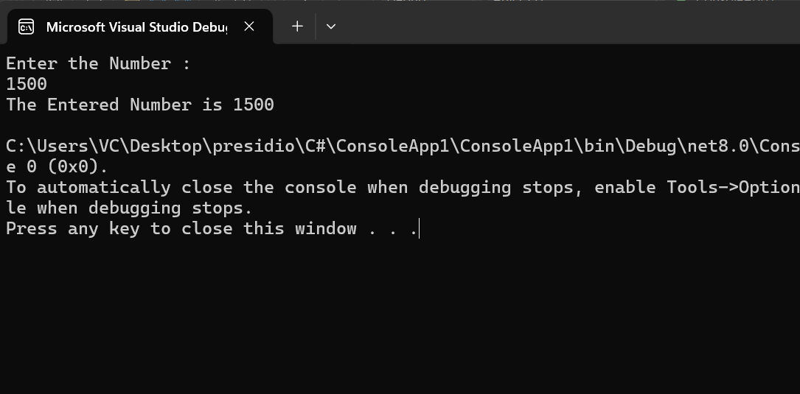
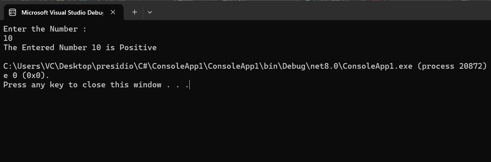
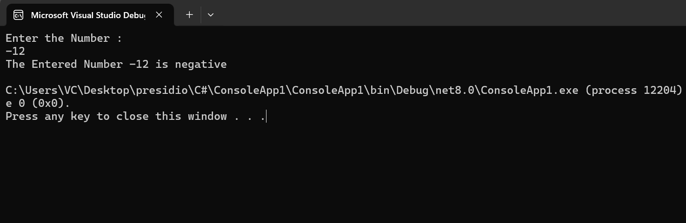
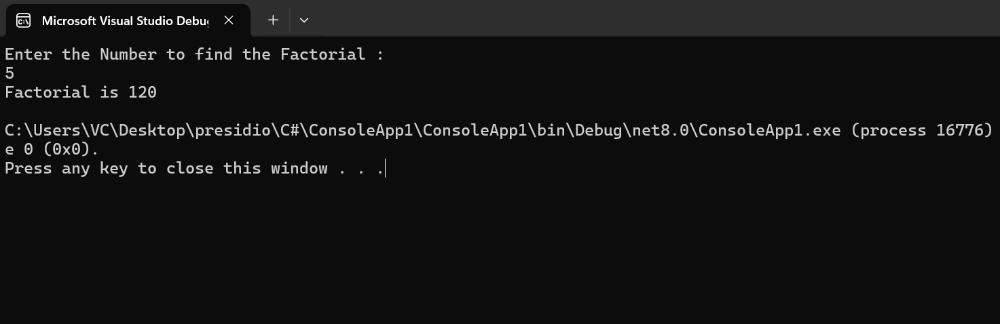

# Task - 1 Basic Data Types, Control Structures, and Methods

## Objective

- Understand the Basic concepts of C#

## Requirement

- Write a console application that calculates the factorial of a given number.
- Read an integer from the user.
- Validate the input (ensure it’s a positive integer).
- Use loops (or recursion) to calculate the factorial.
- Display the result in the console.

## Code Snippet used

### Get Integer Input

```sh
int Name = Convert.ToInt32(Console.ReadLine()); // To get the Input in integer since the input is always in String
```



### Check whether they are Positive or Not

```sh
	if(Num >= 0){
		Positive
	}
	else{
		Negative
	}
```





### Print the Factorial of the Number

```sh
	for(int i = 0; i< num; i++){
		fact *= i;
	}
```

