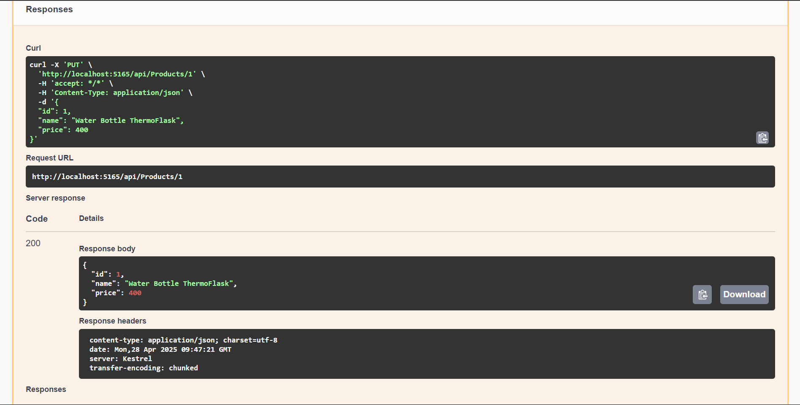

# Task - 10 Building a Mini Microservice with ASP.NET Core

## Objective

- Create a small RESTful API that manages a resource (e.g., Products, Orders, or Books) using ASP.NET Core.

## Requirement

- **Project Setup:**
    - Set up a new ASP.NET Core Web API project.
    - Configure routing and controllers.
- **Dependency Injection:**
    - Implement a service layer and register services using ASP.NET Core’s dependency injection.
- **Data Access:**
    - Use Entity Framework Core with an in-memory database (or SQLite) to perform CRUD operations.
- **Asynchronous Operations:**
    - Use `async`/`await` in your controller actions to handle database operations.
- **Error Handling and Logging:**
    - Implement middleware or filters for global exception handling.
    - Integrate basic logging to record actions and errors.
- **Testing and Documentation:**
    - Write unit tests for your controllers and services.
    - Document the API endpoints (using tools like Swagger).
- **Advanced Considerations (Optional):**
    - Incorporate design patterns such as Repository and Unit of Work.
    - Implement custom middleware for request/response logging or authentication.

## C# Snippet

- The project Structure is listed below

```cs
Task10/
│
├── Controllers/
│    └── ProductsController.cs
├── Models/
│    └── Product.cs
├── Services/
│    ├── IProductService.cs
│    └── ProductService.cs
├── Data/
│    └── AppDbContext.cs
├── Program.cs
├── Task10.csproj
```
- The Output Documentation is shown using the Swagger


- The CRUD Operations Key API Endpoints are listed below

### GET Methods


### POST Methods


### PUT Methods




### DELETE Methods


