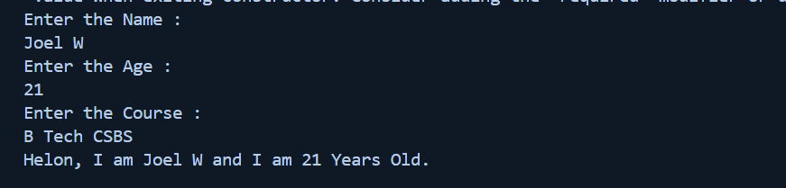

# Task - 2 Simple Object-Oriented Programming

## Objective

- Understand the Basic Object-Oriented Programming

## Requirement

- Create a `Person` class with properties and methods.
- Define properties such as `Name` and `Age`.
- Implement a method `Introduce()` that prints a personalized greeting.
- Instantiate a few `Person` objects in your `Main` method and call `Introduce()` on each.

## Code Snippet Output

```sh
class Person{
    string Name;
    int Age;
    string Course;
    public void Introduce(){
        Console.WriteLine("Helon, I am " + Name + " and I am " + Age + " Years Old");
    }

    public void GetData(){
        Console.WriteLine("Enter the Name : ");
        Name = Console.ReadLine();
        Console.WriteLine("Enter the Age : ");
        Age = Convert.ToInt32(Console.ReadLine());
        Console.WriteLine("Enter the Course : ");
        Course = Console.ReadLine();
    }
}
```

