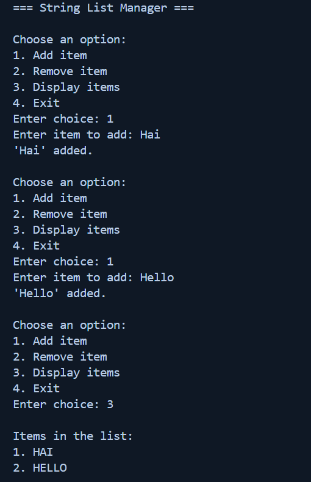
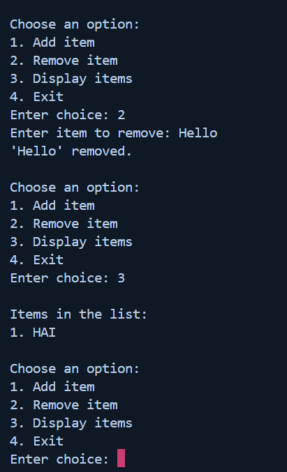

# Task - 3 Basic Collections and String Manipulation

## Objective

- Create the Basic Collections and String Manipulation

## Requirement

- Write a program to manage a list of strings (e.g., names or tasks).
- Use a `List<string>` to store items.
- Allow the user to add, remove, and display items.
- Utilize loops and basic string methods (like `Trim()`, `ToUpper()`) to process user input.

## C# Code used

```cs
    string Item = Console.ReadLine().Trim();

    if (items.Count == 0)
    {
        Console.WriteLine("The list is empty.");
    }
    else
    {
        for (int i = 0; i < items.Count; i++)
        {
            Console.WriteLine($"{i + 1}. {items[i].ToUpper()}");
        }
    }
```


