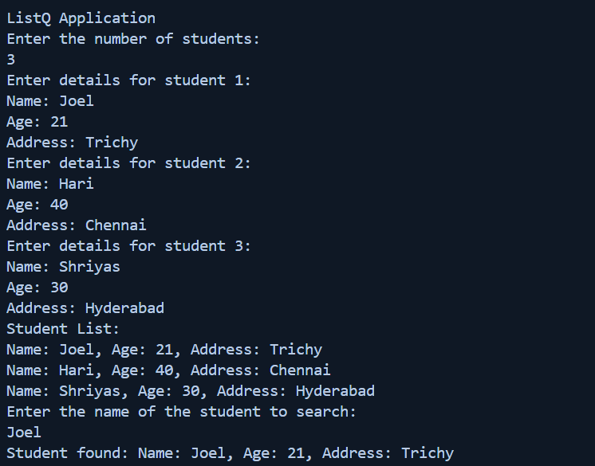
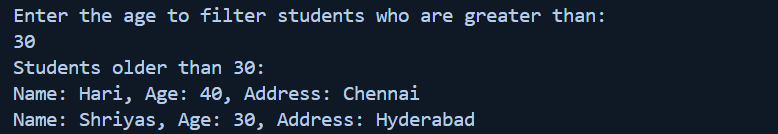
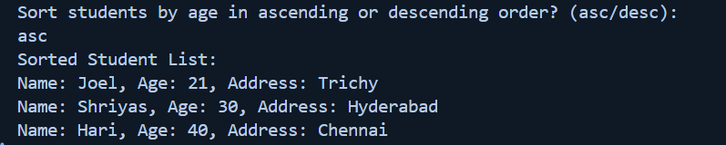

# Task - 4

## Objective

- Create a Collective with ListQ Operations

## Requirement

- Create a student management console application.
- Define a `Student` class with properties such as `Name`, `Grade`, and `Age`.
- Populate a collection (e.g., a `List<Student>`) with sample data.
- Use LINQ to:
    - Filter students who have a grade above a certain threshold.
    - Sort the filtered results by name or grade.
- Display the filtered and sorted list.

## C# Code used



```cs
List<Student> filteredStudents = students.FindAll(s => s.Age >= filterAge);
```



```cs
List<Student> filteredStudents = students.Sort((s1, s2) => s1.Age.CompareTo(s2.Age));
```

