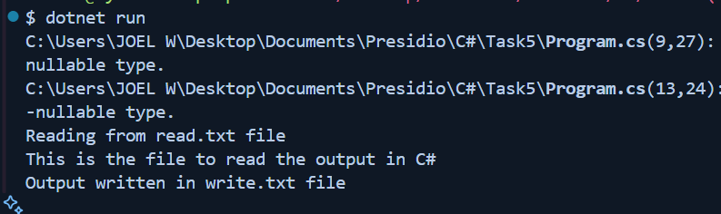
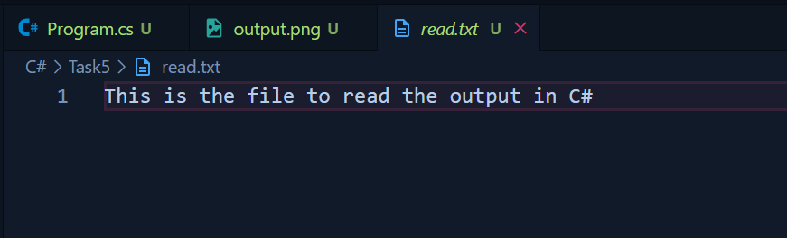
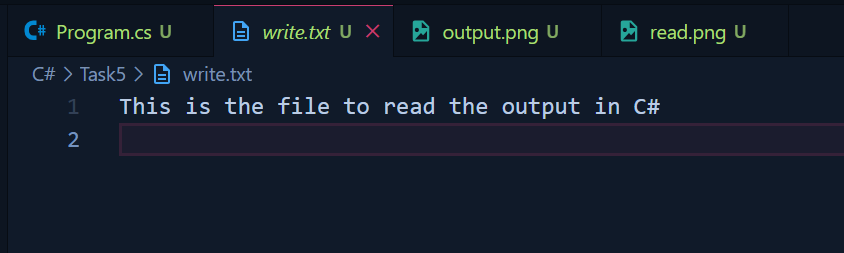

# Task - 5 File I/O and Exception Handling

## Objective

- Implementing the File I/O and Exception Handling

## Requirement

- Develop an application that reads from and writes to files.
- Read text from a file (e.g., a log file or a simple CSV).
- Process the data (for example, count words or lines).
- Write the result to a new file.
- Implement exception handling to manage file-related errors (such as `FileNotFoundException` or `IOException`).

## C# Code used



```cs
StreamReader sr = new StreamReader('filePath');
```



```cs
StreamWriter sw = new StreamWriter('file path');
```


