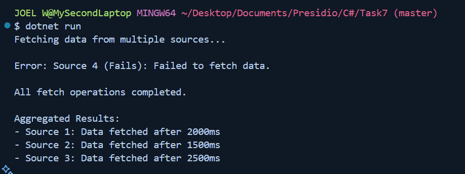

# Task - 7 Asynchronous Programming and Multi-threading

## Objective

- Develop a console application that performs multiple asynchronous operations concurrently.

## Requirement

- Use `async` and `await` to fetch data from multiple simulated sources (e.g., using `Task.Delay` to mimic API calls).
- Aggregate the results once all tasks are complete.
- Handle exceptions that may occur during asynchronous operations.

## C# Snippet used

```cs
Task.Delay(milliseconds)
```

