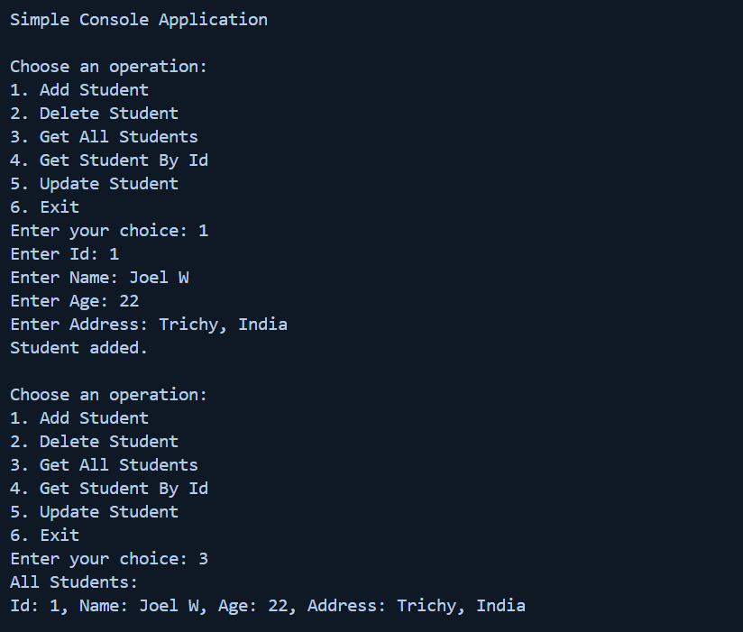
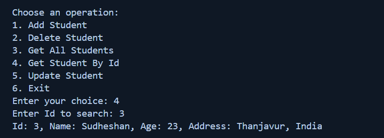
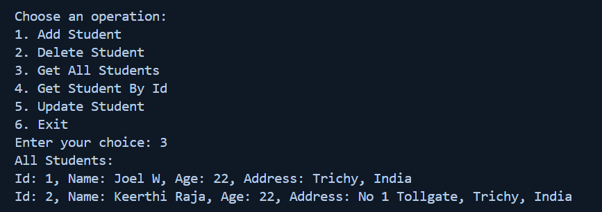
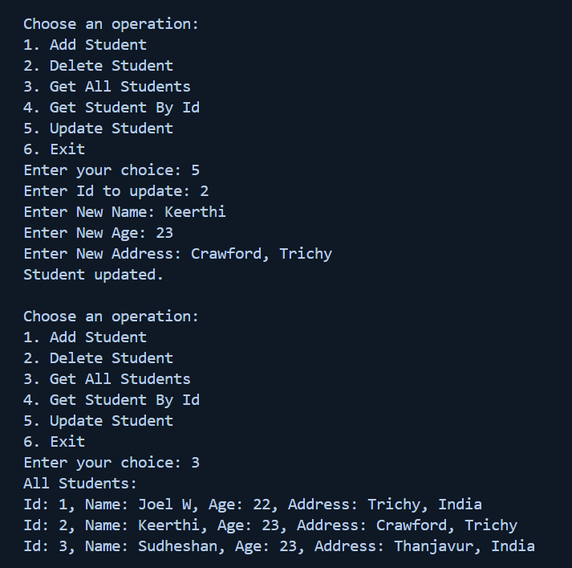
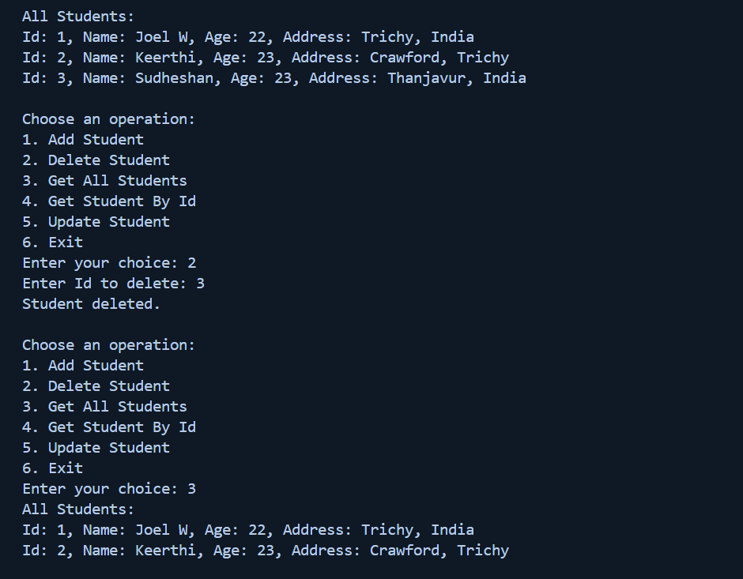

# Task - 8 Generics and Interfaces with a Repository Pattern

## Objective

- Implement a generic in-memory repository to perform CRUD operations.

## Requirement

- Define an interface (e.g., `IRepository<T>`) with methods like `Add`, `Get`, `Update`, and `Delete`.
- Create a generic class that implements this interface.
- Use type constraints if necessary (e.g., where `T : class` or implementing a specific interface).
- Write a simple console UI to demonstrate the repository with a sample entity (e.g., `Product` or `Student`).

## C# Snippet

```cs
// Creating new Interface
    public interface iRepository<T> where T : class
    {
        void Add(T item);
        void Delete(T item);
        IEnumerable<T> GetAll();
        T GetById(int id);
        void Update(T item);
    }
    // Creating a reference class
    public class Students
    {
        public int Id { get; set; }
        public string Name { get; set; }
        public int Age { get; set; }
        public string Address { get; set; }
    }

    // Creating a connection class
    public class StudentRepository : iRepository<Students>
    {
        private List<Students> _students;

        public StudentRepository(List<Students> students)
        {
            _students = students;
        }

        public void Add(Students item)
        {
            _students.Add(item);
        }

        public void Delete(Students item)
        {
            _students.Remove(item);
        }

        public IEnumerable<Students> GetAll()
        {
            return _students;
        }

        public Students GetById(int id)
        {
            return _students.FirstOrDefault(s => s.Id == id);
        }

        public void Update(Students item)
        {
            var existing = GetById(item.Id);
            if (existing != null)
            {
                existing.Name = item.Name;
                existing.Age = item.Age;
                existing.Address = item.Address;
            }
        }
    }
```

### Add and Get All functionalities



### Get Value By Id



### Update functionality





### Deleted functionality


