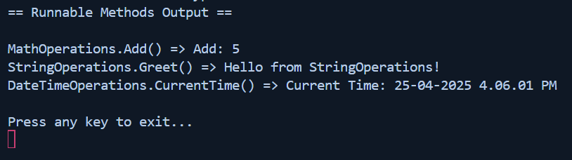

# Task - 9 Reflection and Custom Attributes

## Objective

- Build an application that discovers and executes methods based on custom attributes.

## Requirement

- Define a custom attribute (e.g., `[Runnable]`).
- Create several classes with methods decorated with the `[Runnable]` attribute.
- Use reflection to scan the current assembly for methods marked with `[Runnable]`.
- Invoke the discovered methods dynamically and display their outputs.

## C# Snippet

```cs
[AttributeUsage(AttributeTargets.Method)]
public class RunnableAttribute : Attribute
{
}
```

```cs
var runnableMethods = Assembly.GetExecutingAssembly().GetTypes()
.SelectMany(type => type.GetMethods(BindingFlags.Public | BindingFlags.Instance | BindingFlags.DeclaredOnly))
.Where(method => method.GetCustomAttribute<RunnableAttribute>() != null);
```

