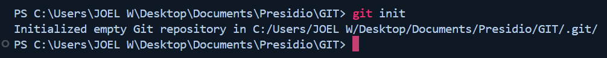
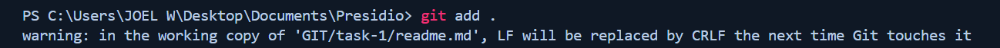

# Task 1 - Initialize, Commit, and Branch Basics
    
## Objectives:    
- Initialize a new Git repository.
- Create a few files and commit them.
- Create a new branch, make changes, and merge it back to the main branch.

## Commands used:

### 1. `git init`
- Initializes a new Git repository in the current directory. 
- It creates a hidden .git folder that stores all version control data.

```sh
git init
```




### 2. `git add filename`
- Stages a specific file to be included in the next commit.
- Staging means marking the file for tracking changes.

#### To add all modified and new files:
```sh
git add .
```


### 3. `git commit -m "message"`
- Commits the staged changes with a descriptive message. 
- A commit saves the changes in the repository’s history.

```sh
git commit -m "Initial commit with file1.txt and file2.txt"
```


### 4. `git branch`
- Displays all branches in the repository. 
- The currently checked-out branch is marked with an asterisk (*).
- Branches allow you to work on different features without affecting the main code.

```sh
git branch
```


#### `git branch branch-name`
- Creates a new branch without switching to it.
```sh
git branch branch-name
```

#### `git branch -m new-branch-name`
- Renames the current branch.
```sh
git branch -m new-branch-name
```

#### `git branch -d branch-name`
Deletes a branch if it has been merged.
```sh
git branch -d branch-name
```


### 5. `git checkout branch-name`
- Switches from the current branch to the specified branch. 
- This is used to move between branches.

```sh
git checkout branch-name
```


#### `git checkout -b branch-name`
- Creates a new branch and switches to it in one step. 

```sh
git checkout -b branch-name
```


### 6. `git merge branch-name`
- Merges the specified branch into the current branch. 
- This incorporates the changes from another branch into the current one.

```sh
git merge branch-name
```


