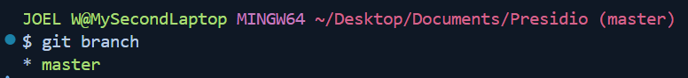
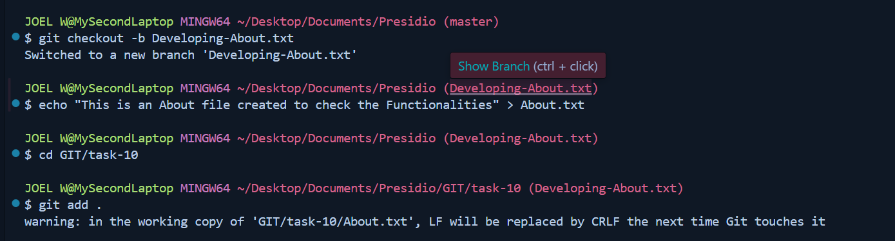
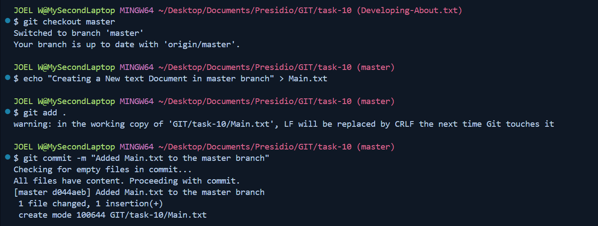
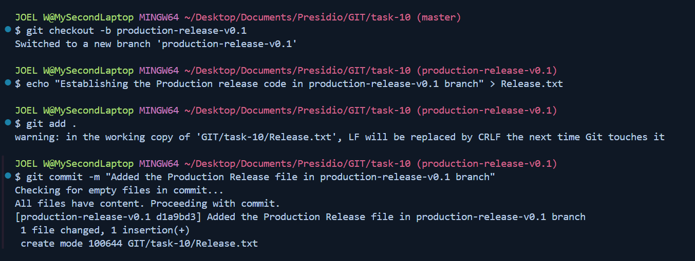
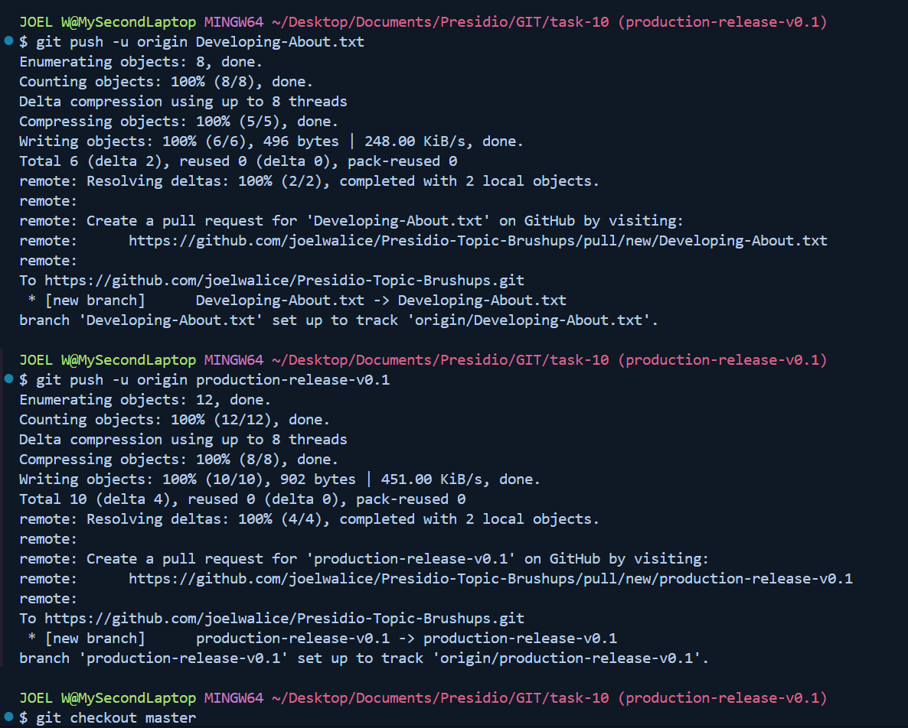
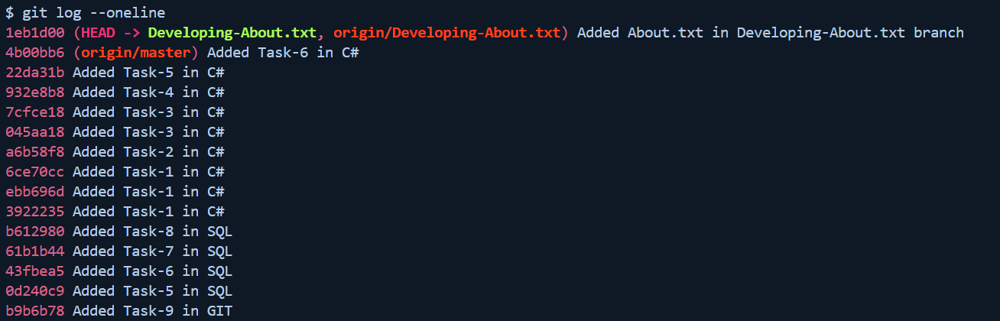
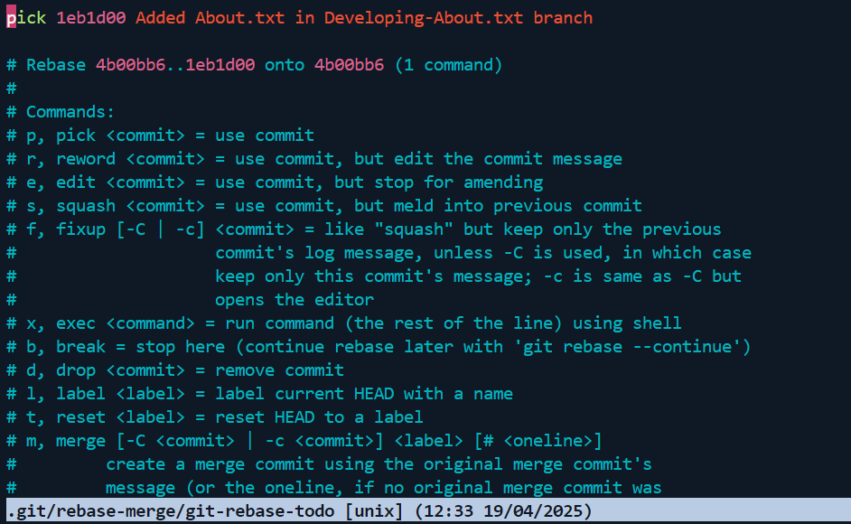
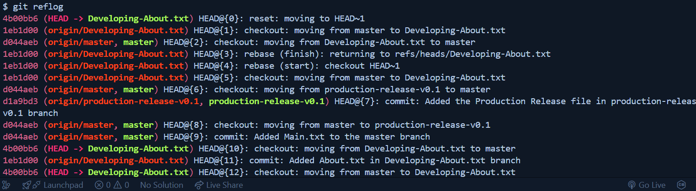
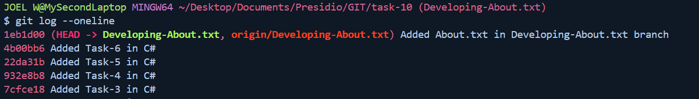

# Task - 10 Comprehensive Workflow with Forced Pushes and Recovery

## Objective

- Simulate an advanced Git scenario that includes forced pushes, recovering lost commits, and a multi-branch workflow.

## Requirement

- Create a repository with multiple branches representing features, bug fixes, and releases.
- Simulate a scenario where a forced push (`git push --force`) is required (for example, after rewriting history with an interactive rebase).
- Use `git reflog` to locate and recover lost commits after a mistaken force push.
- Document each step, explaining how and why forced pushes should be handled with care, and how `git reflog` can be a lifesaver.
- Discuss best practices for collaborating with teams when rewriting history and using force pushes.

## GIT Workflow

#### Initial Requirements


#### Creating the Multiple branches and adding the content







#### Pushing all the content in the multiple branches



#### Log the outcome



#### Checking the REBASE for any commit needed



#### If Any error made

```git
git reset --hard HEAD~1
```

#### You have to use 

```git
git reflog
```



#### Log After reflog

