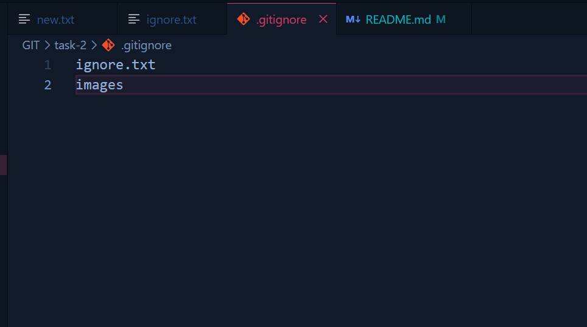

# Task 2 - Using .gitignore and Tracking Files

## Objectives:
- Set up a `.gitignore` file to exclude certain files or directories.
- Verify that ignored files are not tracked by Git.

## Commmands used:

### `git status`
- It displays the current state of the working directory and staging area. 
- It shows which changes have been staged, which files are modified but not yet staged, which files are untracked, and whether there are any commits ahead of or behind the remote repository.
- It does not modify the repository but helps developers track changes before committing.

```sh
git status
```


### `.gitignore`
- A .gitignore file is a configuration file used in Git to specify which files and directories should be ignored by Git. 
- This prevents unnecessary or sensitive files (such as logs, temporary files, environment variables, and build artifacts) from being tracked in a repository.

#### `git status` before adding gitignore: 


#### .gitignore file: 


#### `git status` after adding gitignore: 


###### After using `.gitignore`, running `git status` does not display files or folders that match the patterns in `.gitignore`, confirming they are ignored.
