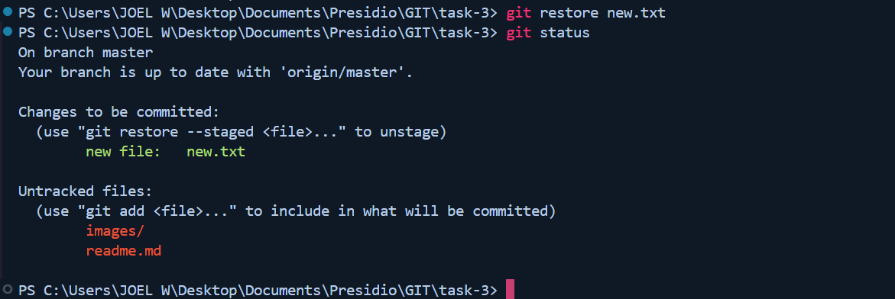
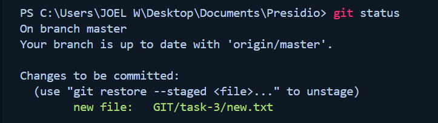
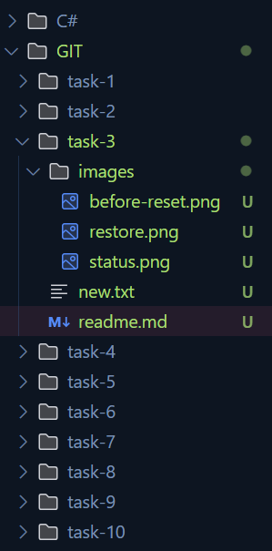
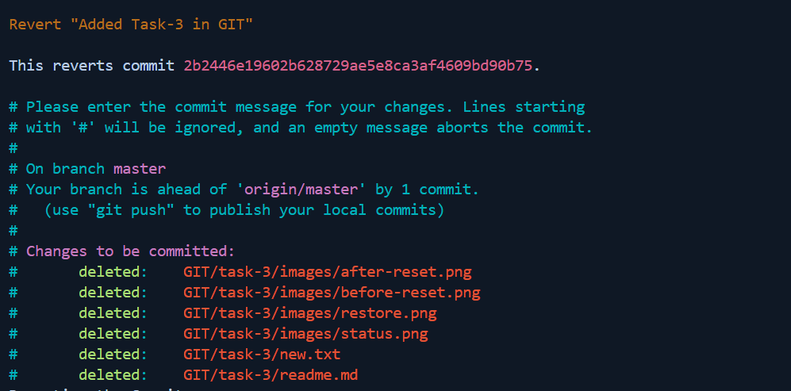

# Task 3 - Undoing Changes and Reverting Commits
    
## Objectives:
- Experiment with undoing changes in your working directory and commits.
    
## Commands Used:

### 1. `git restore file-name`
- **Purpose:** Discards uncommitted changes in a file, restoring it to the last committed state.
- **Use Case:** When you modify a file and want to undo changes before staging.
- It is the newer alternative to `git checkout -- <file>`
- **Effect:** Changes in the working directory are discarded, but the commit history is not affected.

```sh
git restore file.txt
```



```sh
git status
```


### 2. `git reset`
- **Purpose:** Moves the branch pointer (HEAD) to an earlier commit, removing commits from history.

### Before Reset


### After Reset


### `git revert <commit>`

#### `git revert <commit_hash>`:
- Purpose: Creates a new commit that undoes the changes from a specific commit.
- Use Case: When you want to undo changes safely without rewriting history.
- Effect: A new commit is created, preserving history. This is the preferred method for shared repositories.

#### `git revert HEAD`:
- Reverts the most recent commit (HEAD).
- Equivalent to git revert <latest commit hash>.

```sh
git revert HEAD
```

