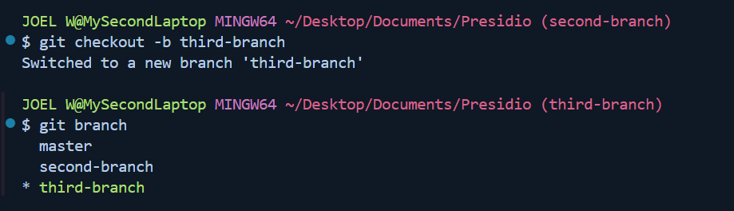
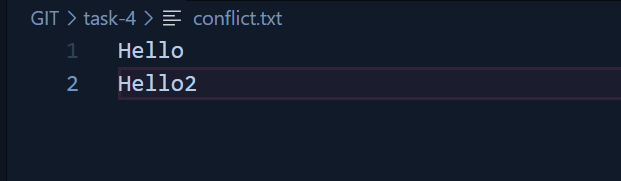

# Task - 4 

## Objective

- Create a scenario that produces a merge conflict and resolve it.

## Requirement

- Create two branches from the same commit.
- Modify the same line(s) of code in a common file in both branches.
- Attempt to merge the branches, observe the conflict, and resolve it manually.
- Use `git status` and `git diff` to identify and resolve the conflicting changes.

## Commands

```sh 
git branch
```


```sh
git checkout <branch-name>
```


- Add the File in the master branch


- Add the File in the second-branch


```sh
git merge <destination>
```


- Manual Conflict fixing



```sh
git status
```

