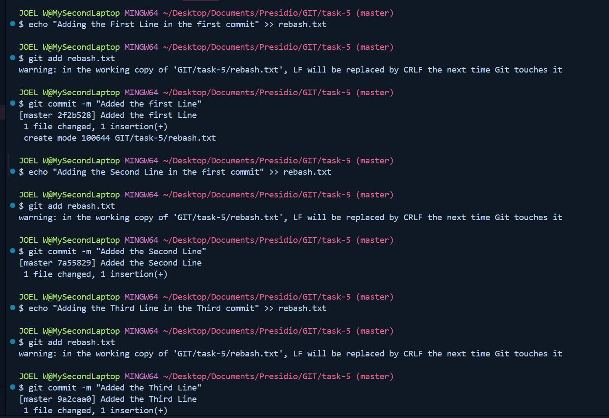
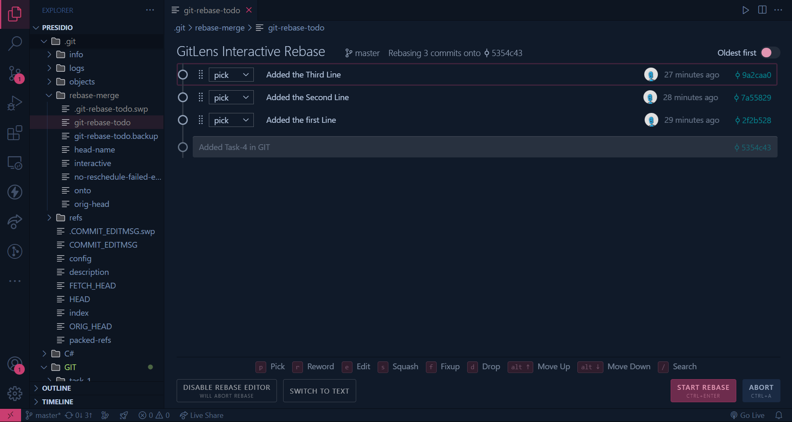
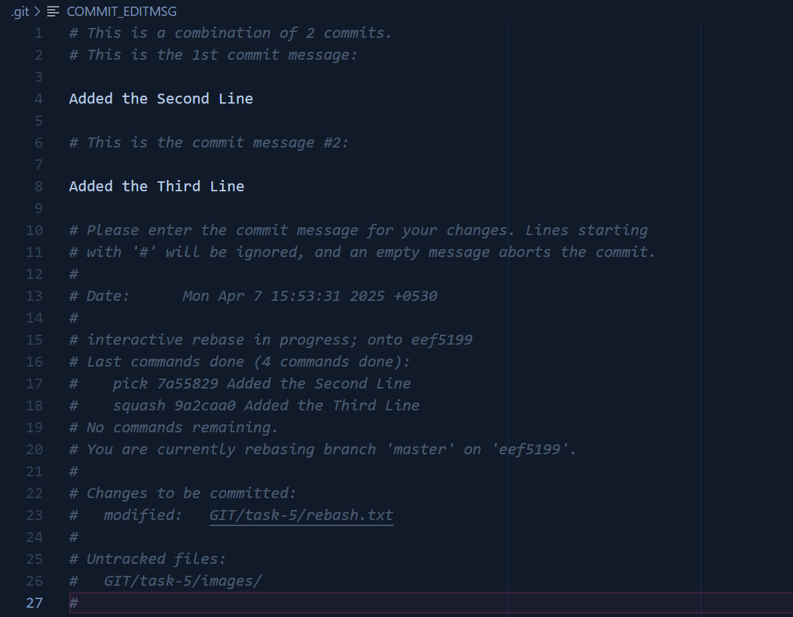
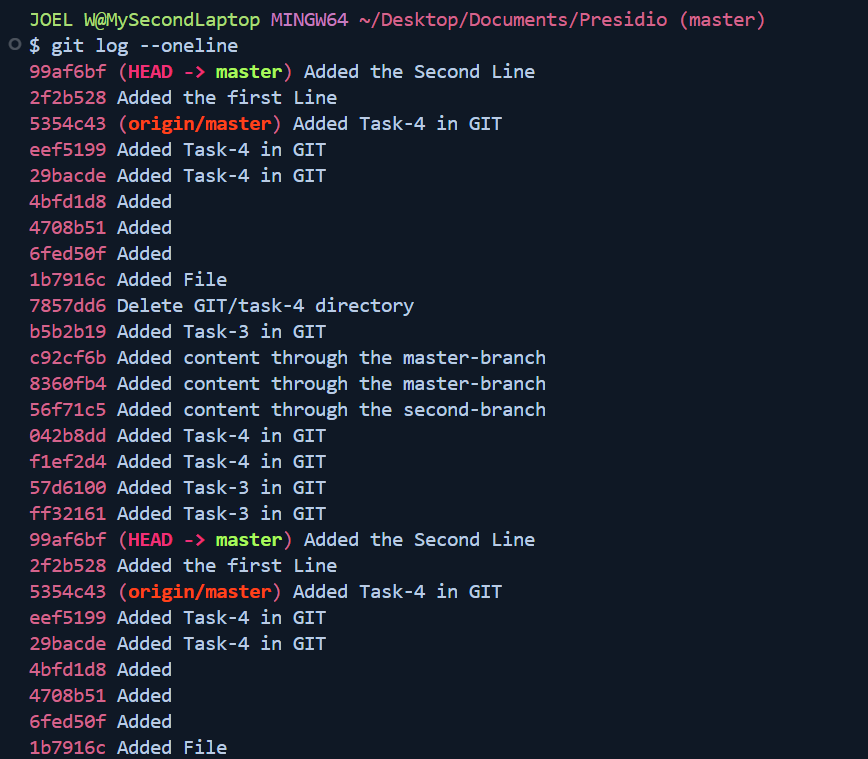
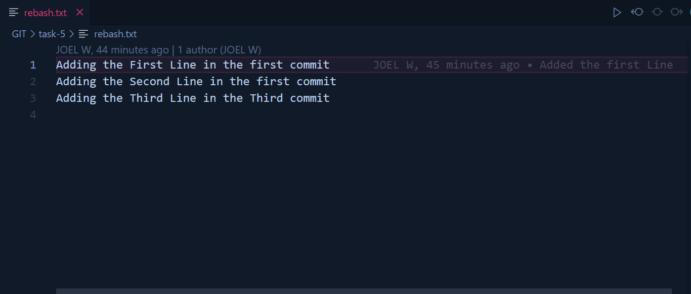

# Task - 5

## Objective

- Use interactive rebase to tidy up your commit history.

## Requirements

- Create a series of commits (some with minor changes or typos in commit messages).
- Run `git rebase -i HEAD~n` (with `n` representing the number of commits) to squash, reorder, and edit commit messages.
- Explain how squashing helps in cleaning up commit history before merging into a main branch.

## Code that has been used

```sh
git commit -m "Message"
```



```sh
git rebase -i HEAD~n
```





```sh
git log --oneline
```



- Output for the Final TXT
