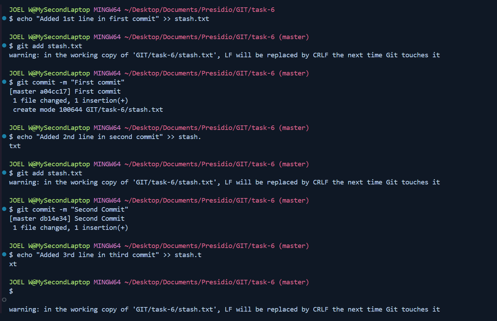
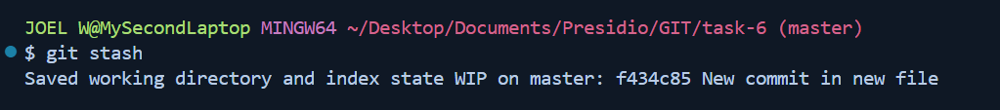
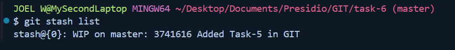
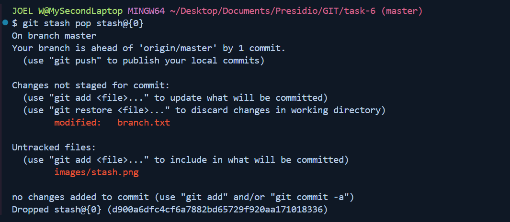

# Task - 6 Stashing Changes for Context Switching

## Objective

- Learn how to use Git stash to save uncommitted work temporarily.

## Requirement

- Make changes in your working directory without committing.
- Use `git stash` to save these changes.
- Switch branches, perform some work, then return and reapply your stashed changes with `git stash pop`.
- Optionally, demonstrate how to view and manage multiple stashes using `git stash list` and `git stash drop`.

## Codes used

```sh
git init .
git add .
```



```sh
git stash
```



```sh
git stash list
```



```sh
git status
```


```sh
git stash pop <stash-val>
```

