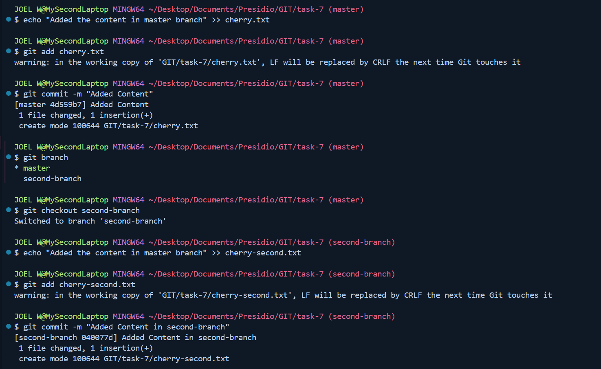
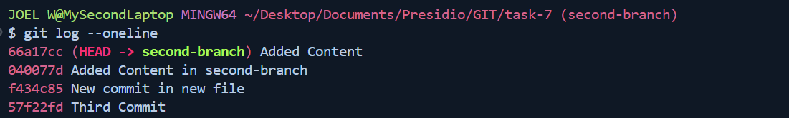
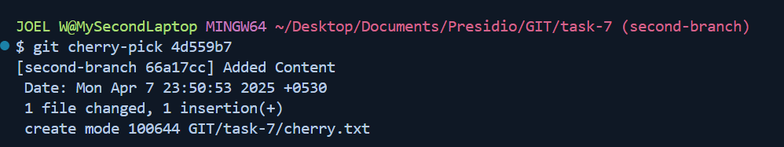

# Task-7 Cherry-Picking Commits Between Branches

## Objective

- Selectively apply a commit from one branch to another using cherry-pick.

## Requirement

- Create two branches with distinct commits.
- Identify a commit on one branch that you want to apply to the other.
- Use `git cherry-pick <commit-hash>` to apply the commit and handle any conflicts if they arise.
- Verify the commit history to ensure the cherry-picked commit is present.

## Codes used in this Task

```sh
git add .
git commit -m <commit-msg>
git checkout -b branch-name
```



- To get the outcome of the Log (or) to check the commit Hash

```sh
git log --oneline
```



```sh
git cherry-pick commit-hash
```



- To Check the Outcome of the cherry-pick

