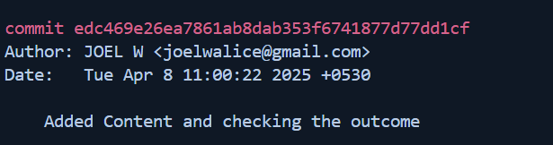
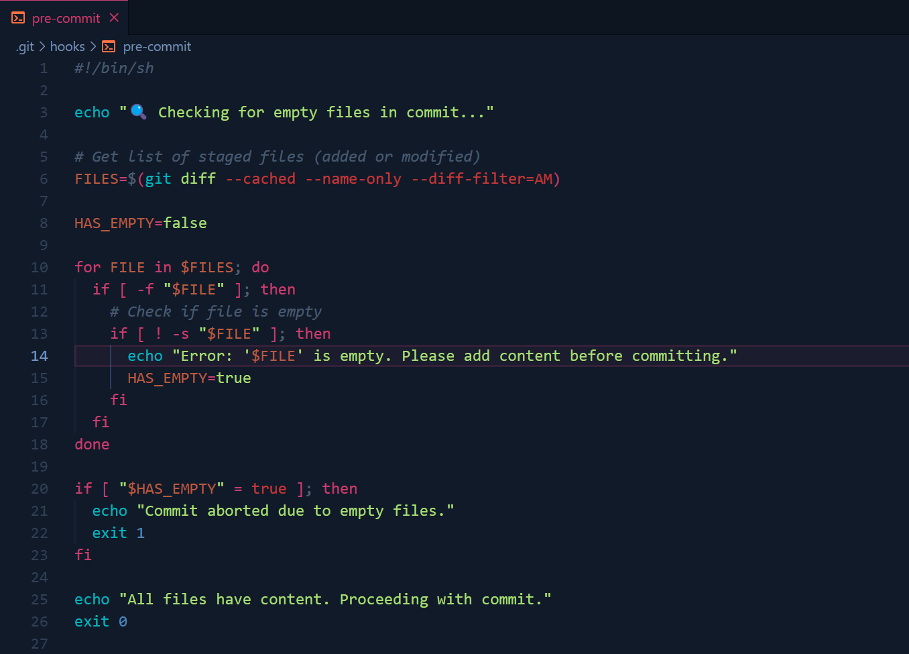
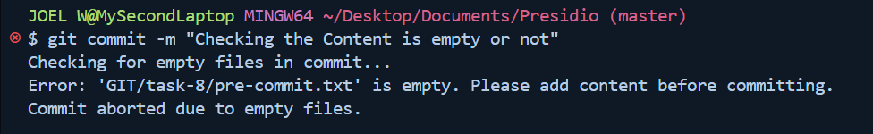
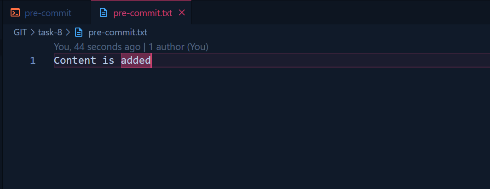
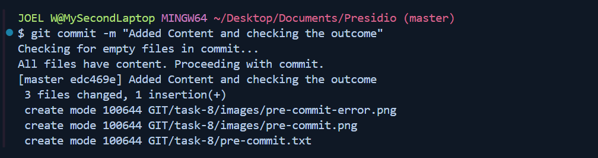

# Task-8 Using Git Hooks for Automated Checks

## Objective

- Set up a Git hook to run scripts (like linters or tests) before commits are finalized.

## Requirement

- Create a `pre-commit` hook in the `.git/hooks` directory.
- Write a simple script (e.g., a shell script or Node script) that runs a linter or a unit test.
- Ensure that if the tests or linting fail, the commit is aborted.
- Document how Git hooks can improve code quality in collaborative projects.

## Codes used in the task

```sh
git add .
git commit -m <commit-message>
```



### Pre-commit code



### If the pre-commit needs to be executed

```sh
chmod u+x .git/hooks/pre-commit
```

### If the file is commited with empty content




### After content in the file






