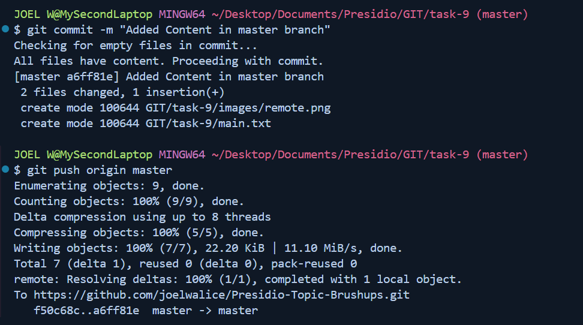
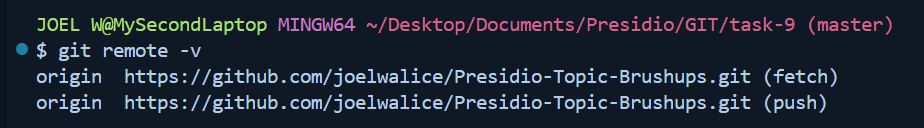
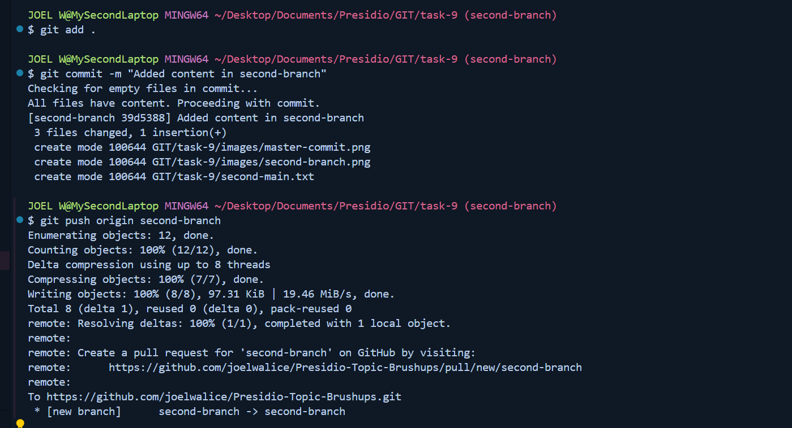
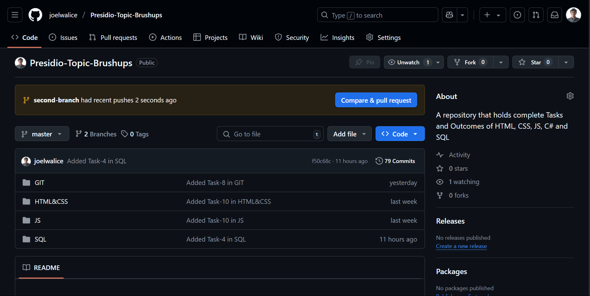
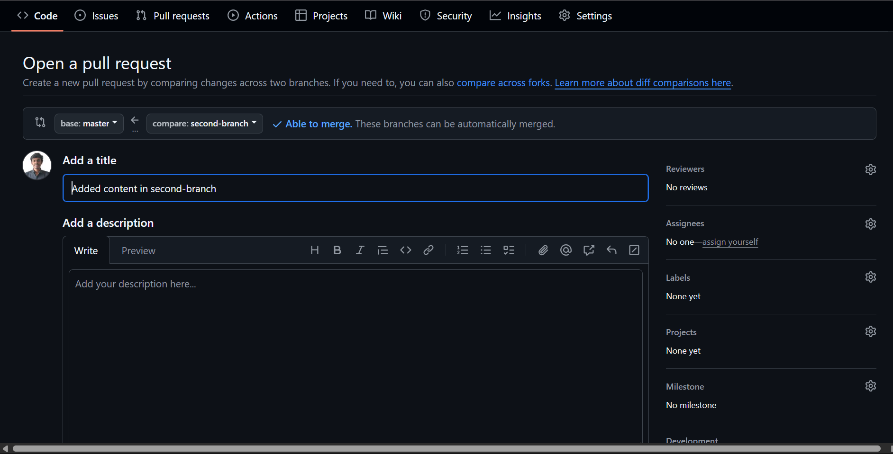
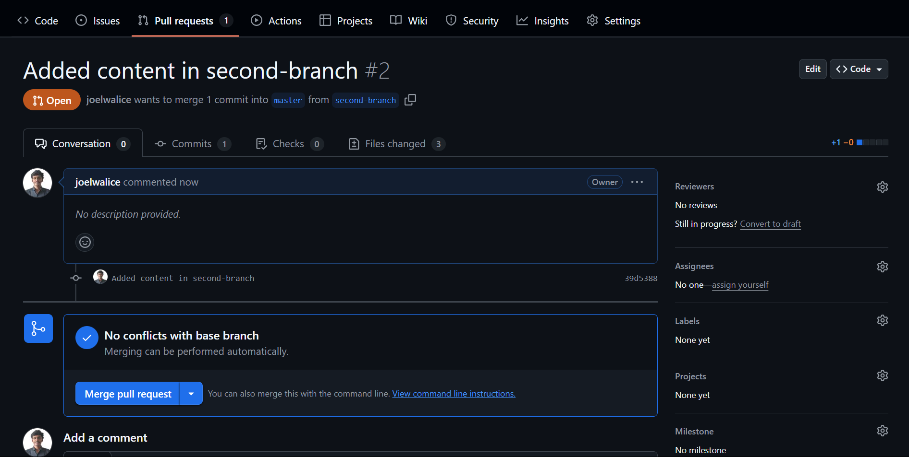
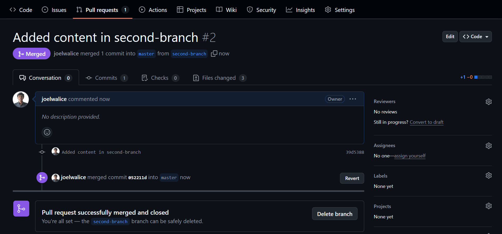
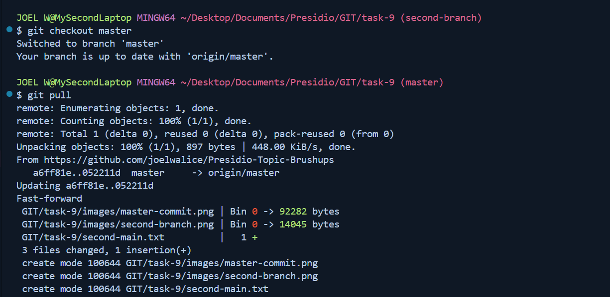

# Task-9 Working with Remote Repositories and Collaboration

## Objective

- Simulate a collaborative workflow with remote repositories.

## Requirement

- Create a local repository and push it to a remote service (e.g., GitHub or GitLab).
- Create a feature branch, make commits, and push the branch to the remote.
- Open a Pull Request (or Merge Request) and perform a code review process.
- Merge the feature branch into the main branch on the remote and then pull the changes locally.

## Codes used in this task

```sh
git init
git remote add origin <repo-name>
git add .
git commit -m "Message"
```



### To Check the remote connection

```sh
git remote -v
```



```sh
git checkout -b branchName
```




### Create a Pull Request







### Merge the branches



### Pull the content

