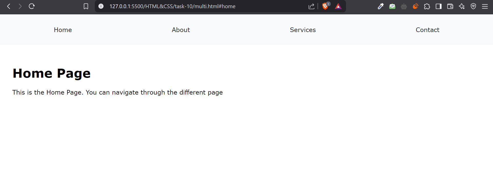
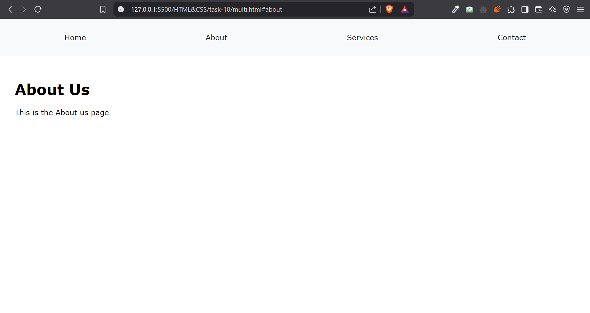
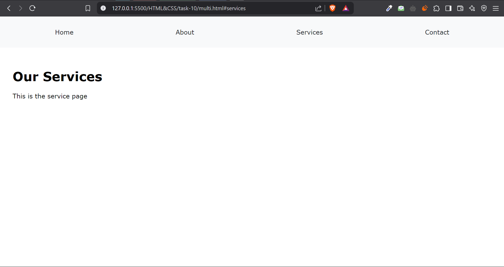

# Task 10

## Objective : 

### -> To create a Multi Page Website that can navigate across the pages on Hyperlinks

## Requirements :

### -> Implement the navigation part to go across the page without using JS

## Steps Involved : 

### -> Included Opacity to zero at default
### -> Made the Navigation Bar to select the Particular Id's
### -> Use :target pseudo class for showing the outcome

## Output : 

