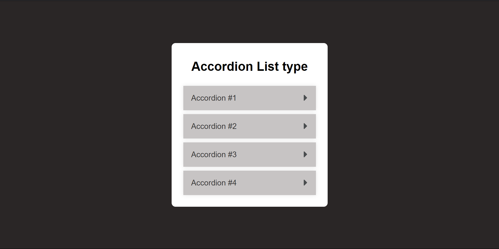
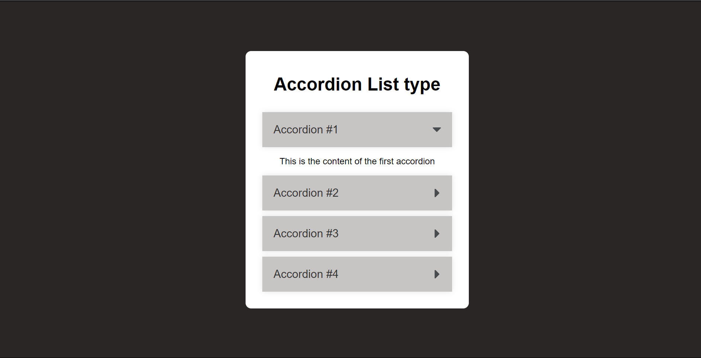
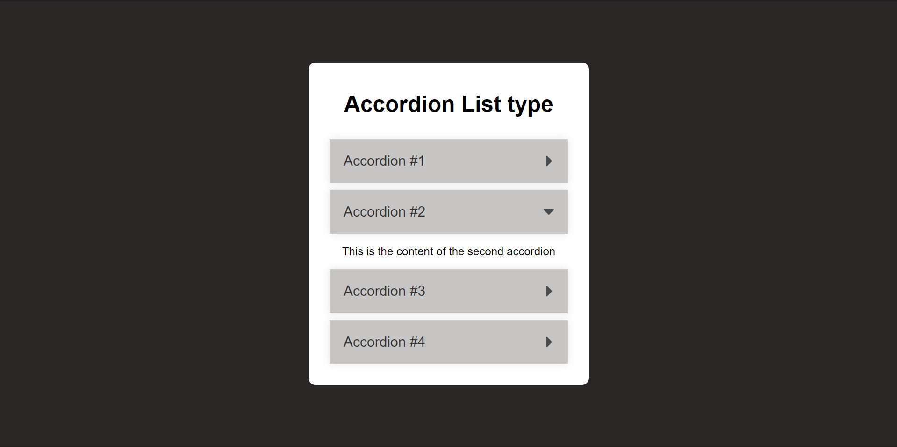
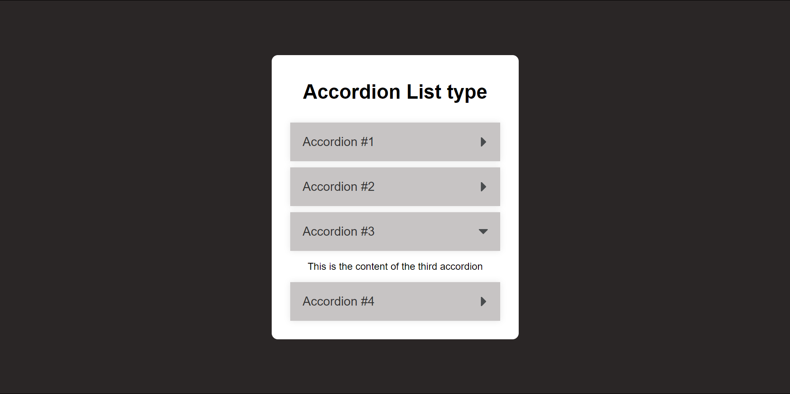
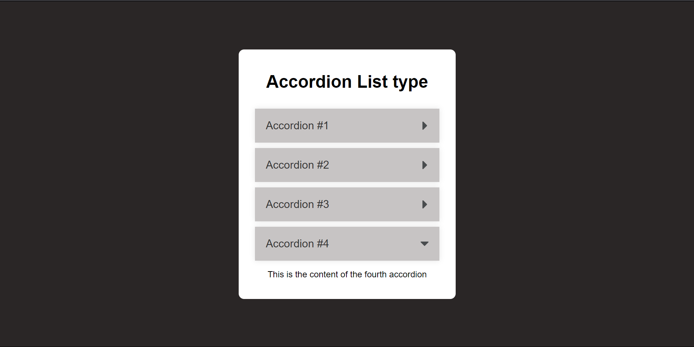
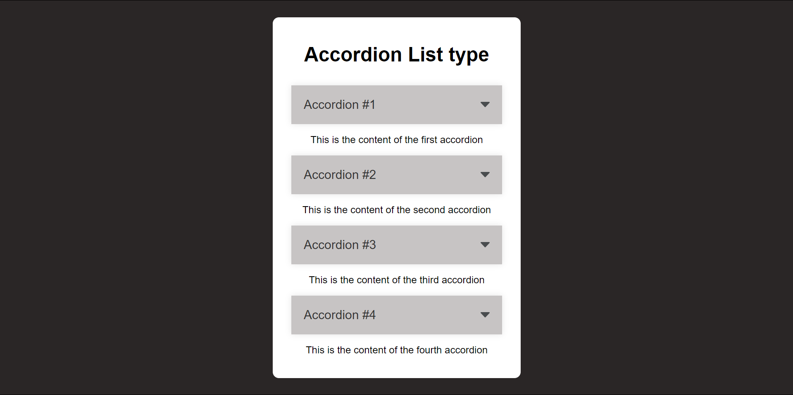

# Output for the Accordian List type using Checkbox(Used for toggle and untoggle)

## Output of Basic Structure

## Output of 1st Accordian image

## Output of 2nd Accordian image

## Output of 3rd Accordian image

## Output of 4th Accordian image

## We can toggle multiple list items

