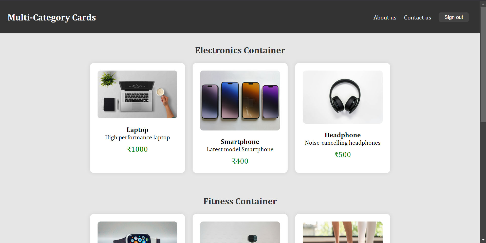
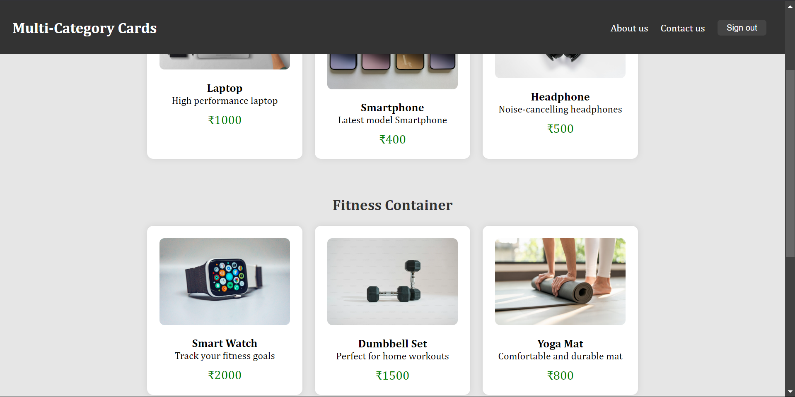

# Task-9

## Objective

### Design a sophisticated webpage layout that combines CSS Grid and Flexbox techniques.

## Requirements

### Flexbox, Overlapping elements and sticky header

## Implementation

### Used Flexbox components, Added multiple components using column way and added sticky property in CSS for the Header

## Output

### Overall Layout

