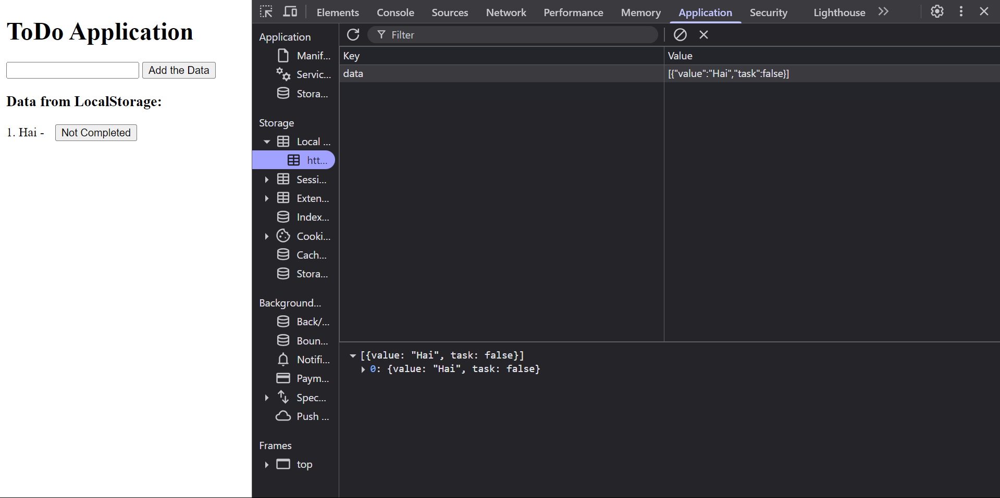

# Output for the To-Do Application 

## Objective - Create a simple to-do list app where users can add new tasks, mark them as complete, and remove them.

## Requirements - Use DOM for the CRUD Operations, Add Localstorage to store the data

## Output on adding the data through the HTML Input

## Output on getting the data through localStorage
