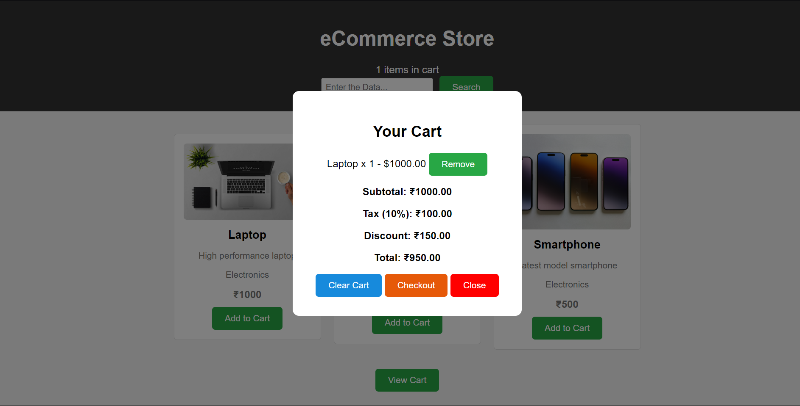
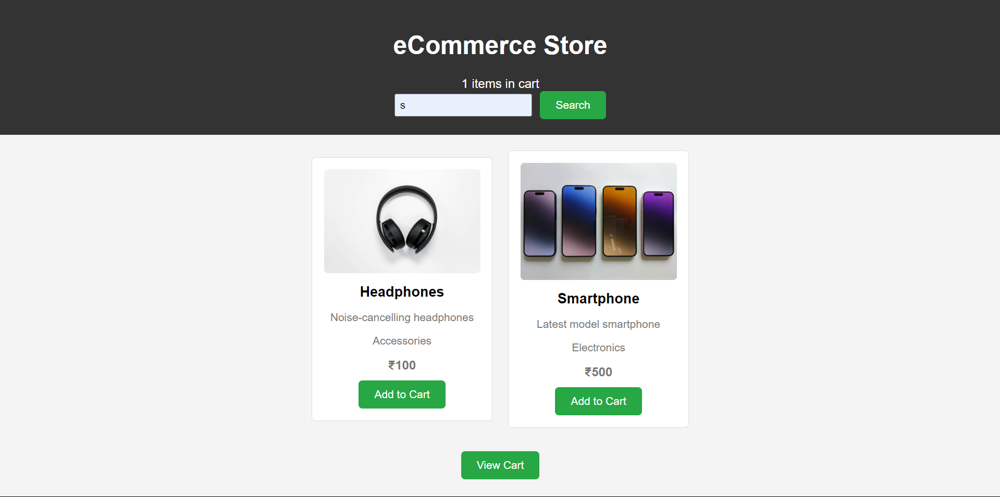

# Task-10

## Objective -  Build a comprehensive eCommerce simulation that includes product listings, a shopping cart, and dynamic price calculations.

## Requirements - Add Product Listing, Shopping cart, State Management, Search, Responsive UI

## Steps invloved : 

### 1). Added Functionalities of AddItem, State Management, searchItem as separate functions

### 2). Created ecomm.html, styles.css and ecomm.js for the project

## Outputs : 

