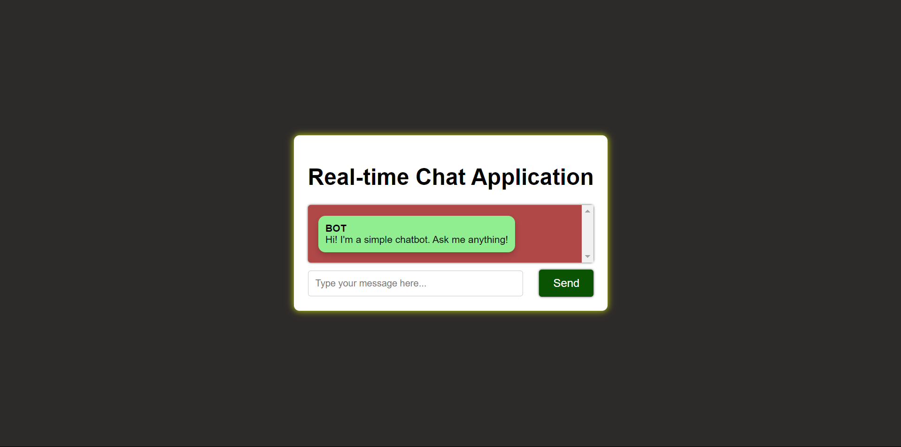
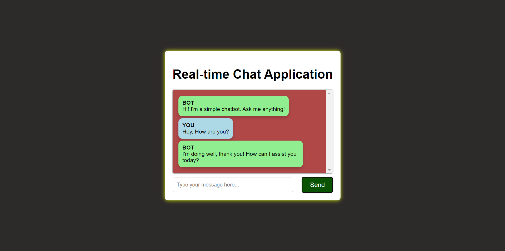
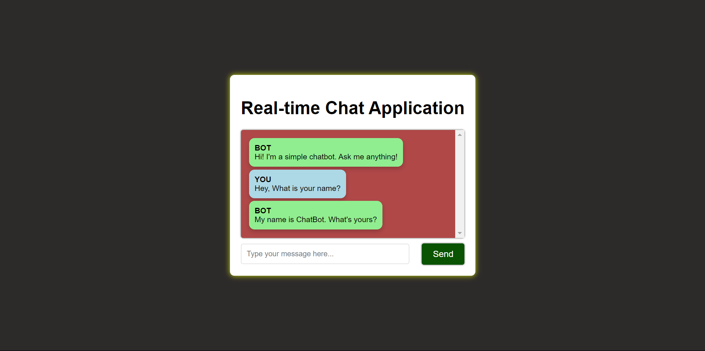
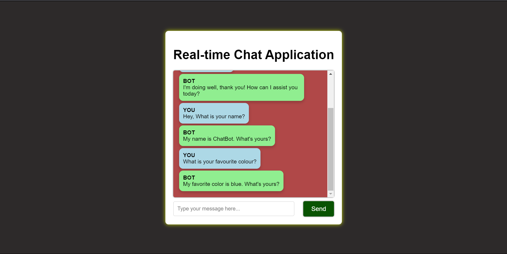
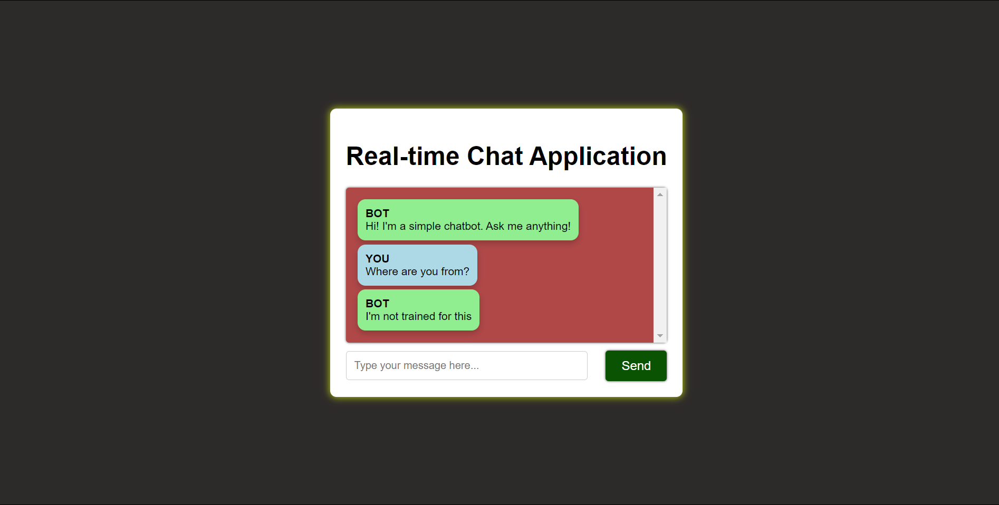

# Output for the Chat Application using setTimeout

## Output for the message : How are you?

## Output for the Message : What is your name?

## Output for the Message : What is your favourite colour?

## Output for the Message not declared 

