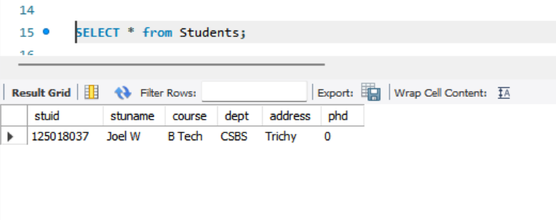

# Task-1 Creating and Populating Tables

## Objective

- Set up a simple table, insert data, and retrieve that data using basic queries.

## Requirement

- Use `CREATE TABLE` to define a table (e.g., `Employees` or `Products`) with appropriate data types and constraints.
- Populate the table using `INSERT INTO` with multiple rows of sample data.
- Execute a basic `SELECT * FROM TableName;` query to verify the data insertion.

## SQL Query used

```sh
create database presidio;
use presidio; # For using the current Database

create table Students(
	stuid integer,
    stuname varchar(20),
    course varchar(20),
    dept varchar(20),
    address varchar(20),
    phd boolean
);
```


### For Insertion of the Data

```sh
INSERT INTO Students values(125018037, "Joel W", "B Tech", "CSBS", "Trichy", false);
```


```sh
SELECT * FROM Students;
```

