# Task - 10 Comprehensive Database Design, Optimization, and Advanced Features

## Objective

- Design a normalized database schema for a complex business scenario (e.g., an eCommerce platform) and implement advanced SQL features to ensure performance, data integrity, and automation.

## Requirement

- **Schema Design:**
    - Design and create multiple related tables (e.g., `Products`, `Customers`, `Orders`, `OrderDetails`) with proper primary and foreign keys, unique constraints, and normalization practices.
- **Indexing and Performance:**
    - Analyze query performance and apply indexing strategies to optimize frequently executed queries.
- **Triggers:**
    - Implement triggers to enforce business rules automatically (e.g., update inventory levels upon order insertion, log changes to critical tables).
- **Transactions:**
    - Use transactions (`BEGIN TRANSACTION`, `COMMIT`, and `ROLLBACK`) to ensure data consistency during multi-step operations (e.g., order processing where multiple tables are updated).
- **Views and Materialized Views (Optional):**
    - Create views to simplify complex joins and aggregations.
    - Optionally, design materialized views if your SQL dialect supports them to cache expensive query results.
- **Documentation and Testing:**
    - Document your schema and SQL scripts.
    - Write test queries to demonstrate that all constraints, triggers, and transactions work as intended.

## SQL Snippet Used

#### Schema Design

```sql
CREATE TABLE Products (
  pid INT PRIMARY KEY AUTO_INCREMENT,
  pname VARCHAR(20),
  price DECIMAL,
  category_id INT,
  qty INT
);

CREATE TABLE Categories(
    category_id INT PRIMARY KEY AUTO_INCREMENT,
    category_name VARCHAR(255) NOT NULL
);

CREATE TABLE Customers(
	cid INT PRIMARY KEY,
    cname VARCHAR(30),
    address VARCHAR(30),
    email VARCHAR(30) UNIQUE NOT NULL,
    phone INT
);

CREATE TABLE Orders(
  oid INT PRIMARY KEY,
  cid INT,
  order_date DATE,
  total_price DECIMAL,
  FOREIGN KEY (cid) REFERENCES Customers(cid)
);

CREATE TABLE OrderDetails(
  order_detail_id INT PRIMARY KEY,
  oid INT,
  pid INT,
  quantity INT,
  price_at_time DECIMAL,
  FOREIGN KEY (oid) REFERENCES Orders(oid),
  FOREIGN KEY (pid) REFERENCES Products(pid)
);

```

#### Insertion of Data

```sql
INSERT INTO Categories (category_name) VALUES
('Electronics'),
('Fashion'),
('Home Appliances'),
('Books'),
('Toys');

INSERT INTO Products (pname, price, category_id, qty) VALUES
('Bluetooth Speaker', 49.99, 1, 100),
('Men\'s T-Shirt', 19.99, 2, 200),
('Air Fryer', 89.50, 3, 50),
('Cookbook', 15.00, 4, 80),
('Lego Set', 35.75, 5, 60),
('Smart Watch', 129.99, 1, 40),
('Women\'s Jacket', 59.95, 2, 75);

INSERT INTO Customers (cid, cname, address, email, phone) VALUES
(1, 'Alice Walker', '123 Maple Street', 'alice@example.com', '9876543210'),
(2, 'Bob Johnson', '456 Oak Road', 'bob@example.com', '9823456789'),
(3, 'Carla Diaz', '789 Pine Avenue', 'carla@example.com', '9812345678');

INSERT INTO Orders (oid, cid, order_date, total_price) VALUES
(1, 1, '2025-04-21', 69.98),
(2, 2, '2025-04-22', 129.50),
(3, 3, '2025-04-23', 165.74);
```

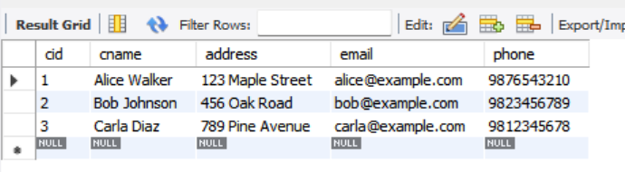;

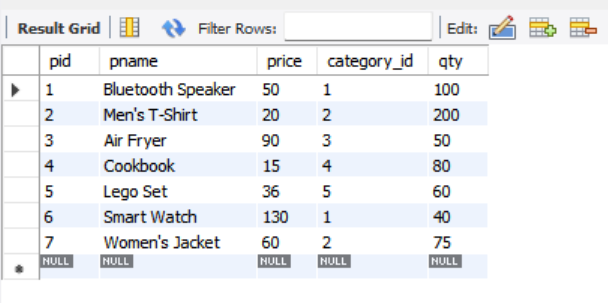;

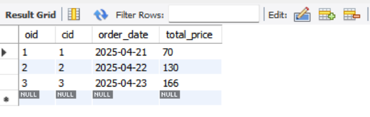;

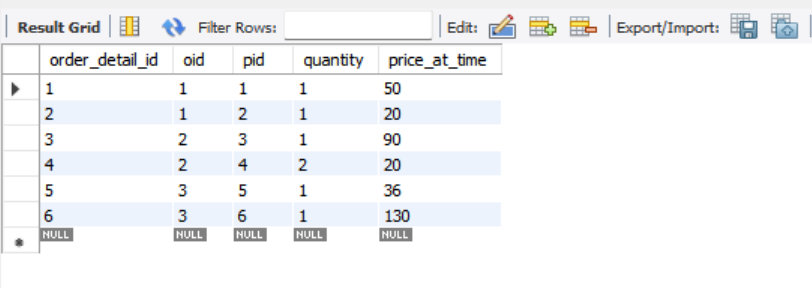;

#### Indexing

```sql
CREATE INDEX product_idx ON Products(pid);
CREATE INDEX customer_idx ON Customers(cid);
CREATE INDEX order_idx ON Orders(oid);
CREATE INDEX orderdetails_idx ON OrderDetials(order_detail_id);

SHOW INDEXES from Products;
SHOW INDEXES from Customers;
SHOW INDEXES from Orders;
SHOW INDEXES from OrderDetails;
```

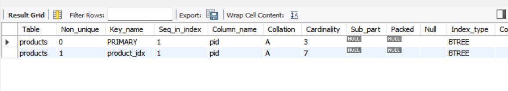;

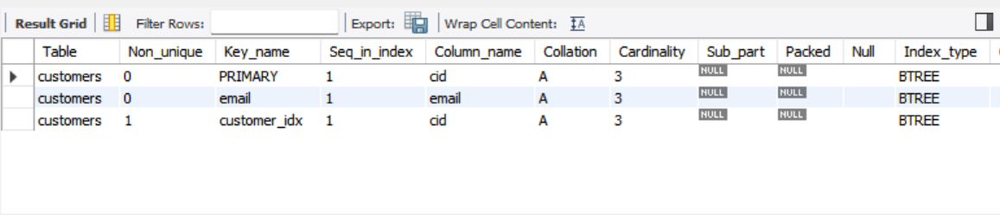;

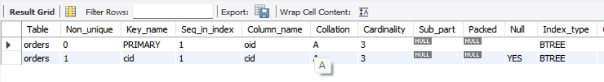;

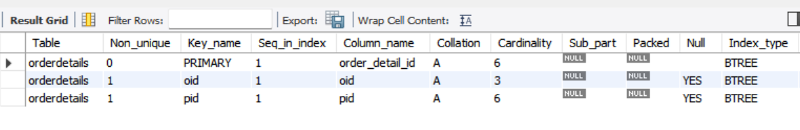;

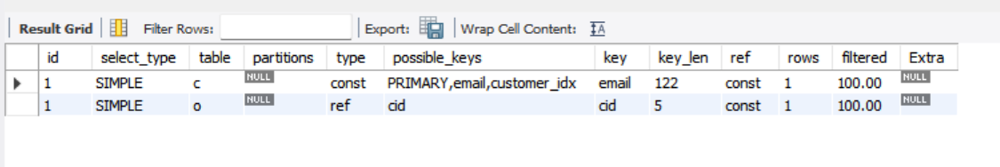;

#### PROFILING/ EXPLAIN ANALYSE

```sql
EXPLAIN ANALYZE
SELECT * 
FROM Orders o
JOIN Customers c ON o.cid = c.cid
WHERE c.email = 'alice@example.com'
LIMIT 10;
```

- PROFILING Works only on MySQL < 5.7. So, I used EXPLAN ANALYSE
- To Check Version use `SELECT VERSION()`

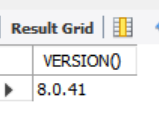;

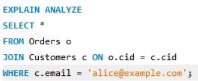;

#### Triggers

```sql
DELIMITER $$

CREATE TRIGGER trg_update_inventory_after_order
AFTER INSERT ON OrderDetails
FOR EACH ROW
BEGIN
  UPDATE Products
  SET qty = qty - NEW.quantity
  WHERE pid = NEW.pid;
END$$

DELIMITER ;

SELECT pname, qty from Products WHERE pid = 5;
```

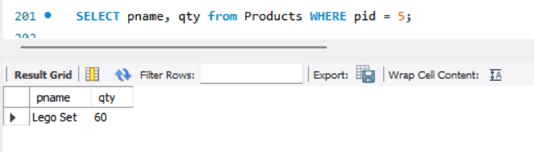;

#### Transaction

```sql
START TRANSACTION;

INSERT INTO Orders (oid, cid, order_date, total_price)
VALUES (1001, 1, CURDATE(), 500.00);

INSERT INTO OrderDetails (order_detail_id, oid, pid, quantity, price_at_time)
VALUES 
  (7, 1001, 1, 2, 100.00),
  (8, 1001, 2, 1, 300.00);

UPDATE Products SET qty = qty - 2 WHERE pid = 1;
UPDATE Products SET qty = qty - 1 WHERE pid = 2;

COMMIT;
```

#### VIEWS

```sql
CREATE VIEW OrderView AS 
SELECT o.oid, p.pid, c.cid, p.pname, cat.category_name
FROM Orders o
JOIN Customers c ON o.cid = c.cid
JOIN OrderDetails od ON o.oid = od.oid
JOIN Products p ON od.pid = p.pid
JOIN Categories cat ON p.category_id = cat.category_id
WHERE c.cid = 1;

SELECT * FROM OrderView;
```

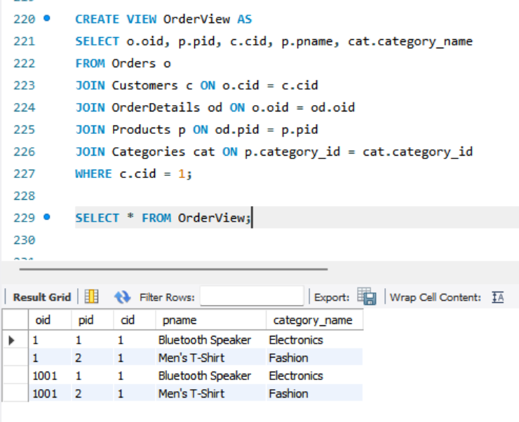;