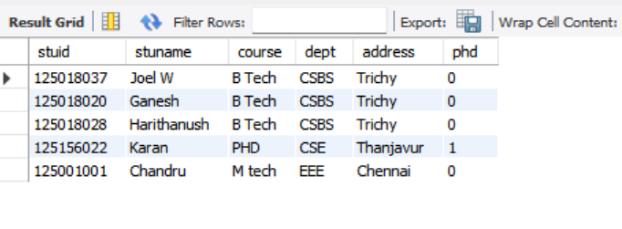
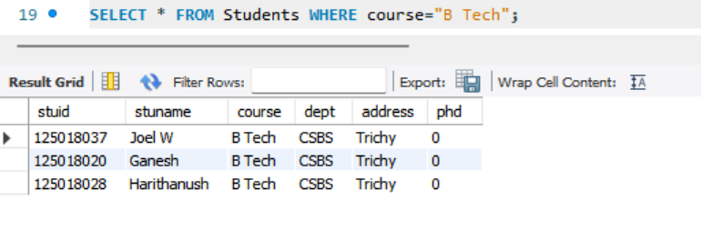
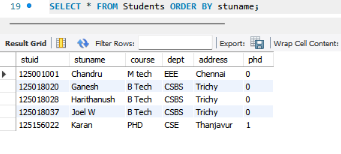
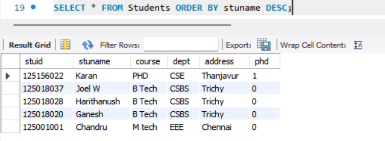
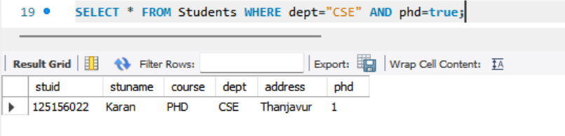
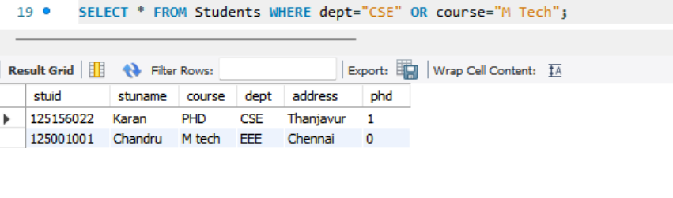

# Task-2 Basic Filtering and Sorting

## Objective

- Write queries that filter records and sort the result set.

## Requirement

- Use the `WHERE` clause to filter records based on a condition (e.g., `WHERE Department = 'Sales'`).
- Apply the `ORDER BY` clause to sort the results (e.g., by `LastName` or `Salary`).
- Experiment with multiple conditions using `AND`/`OR`.

## SQL Query used in task

```sh
SELECT * FROM Students;
```



```sh
SELECT * FROM Students WHERE course="B Tech";
```



```sh
SELECT * FROM Students ORDER BY stuname;
```



```sh
SELECT * FROM Students ORDER BY stuname DESC;
```



```sh
SELECT * FROM Students WHERE dept="CSE" AND phd="true";
```



```sh
SELECT * FROM Students WHERE dept="CSE" OR course="M Tech";
```

