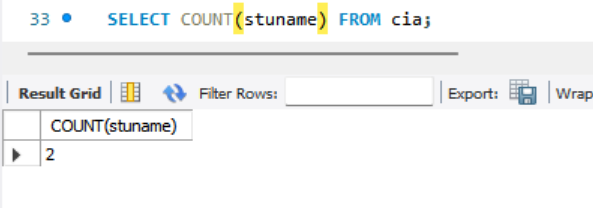
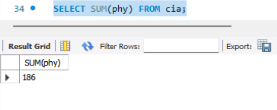
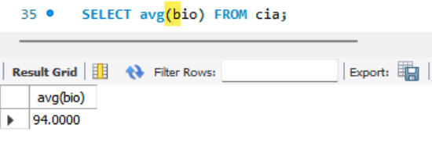
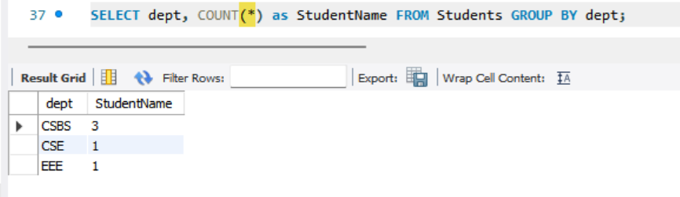
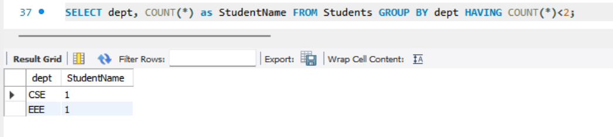

# Task - 3 Simple Aggregation and Grouping

## Objective:

- Summarize data using aggregate functions and grouping.

## Requirements:

- Write a query that uses aggregate functions such as `COUNT()`, `SUM()`, or `AVG()` to calculate totals or averages.
- Use the `GROUP BY` clause to aggregate data by a specific column (e.g., count the number of employees per department).
- Optionally, filter grouped results using the `HAVING` clause.

## SQL Query used

```sh
SELECT COUNT(stuname) FROM cia;
```



```sh
SELECT SUM(phy) FROM cia;
```



```sh
SELECT avg(bio) FROM cia;
```



```sh
SELECT dept, COUNT(*) as StudentName FROM Students GROUP BY dept;
```



```sh
SELECT dept, COUNT(*) as StudentName FROM Students GROUP BY dept HAVING COUNT(*)<2;
```

