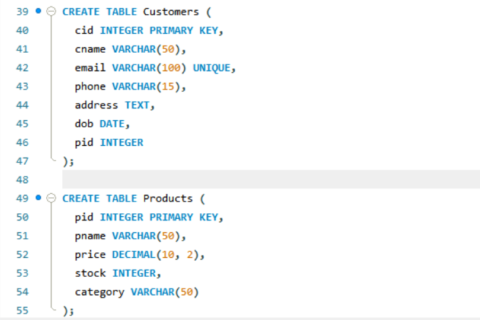
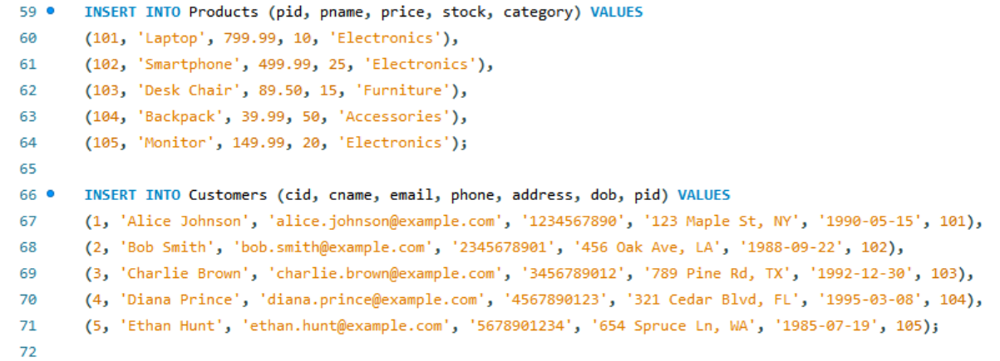

# Task-4 Multi-Table JOINs

## Objective

- Combine data from two related tables using JOIN operations.

## Requirement

- Create two related tables (e.g., `Customers` and `Orders`) with a foreign key relationship.
- Write an `INNER JOIN` query to retrieve combined information (e.g., customer names along with their order details).
- Experiment with other types of joins such as `LEFT JOIN` to understand how missing matches are handled.

## SQL Query used

```sh
CREATE TABLE <tablename>
ALTER TABLE <tablename> ADD CONSTRAINT fk_pid FOREIGN KEY (pid) REFERENCES Products(pid)
```






### Different Types of JOINS

#### INNER JOIN

```sh
SELECT Customers.cname, pname, price, stock, category from Products INNER JOIN Customers WHERE Products.pid = Customers.pid;
```


#### LEFT JOIN

```sh
SELECT Customers.pid, pname from Products LEFT JOIN Customers ON Products.pid = Customers.pid;
```


#### RIGHT JOIN

```sh
SELECT Customers.pid, pname from Products RIGHT JOIN Customers ON Products.pid = Customers.pid;
```

