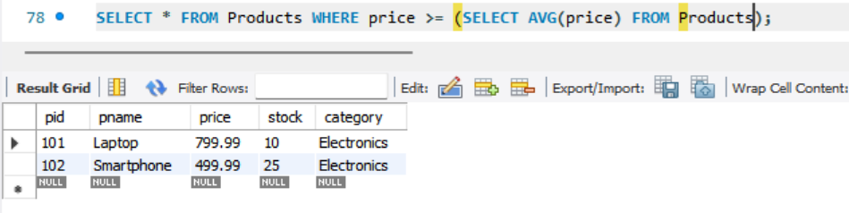

# Task-5 Subqueries and Nested Queries

## Objective

- Use subqueries to filter or compute values within a main query.

## Requirement

- Write a query that uses a subquery in the `WHERE` clause (e.g., select employees whose salary is above the department’s average salary).
- Alternatively, use subqueries in the `SELECT` list to compute dynamic columns.
- Understand the difference between correlated and non-correlated subqueries.

## SQL Query used

#### Sub Queries using WHERE

```sh
SELECT * FROM Products WHERE price >= (SELECT AVG(price) FROM Products);
```



### Sub SELECT Query

```sh
SELECT pid, pname, category, price, (SELECT AVG(price) FROM Products) AS avg_price FROM Products;
```


## Correlated vs Non-Correlated Subqueries in SQL

### 1. Non-Correlated Subquery

A **non-correlated subquery** executes **independently** of the outer query.  
It runs **only once**, and the result is used by the outer query.

#### Example:
```sql
SELECT * 
FROM Products 
WHERE price > (SELECT AVG(price) FROM Products);
```

- The subquery `SELECT AVG(price) FROM Products` runs once.
- The outer query uses the result to filter rows.

#### Characteristics:
- Executes once.
- Independent of outer query.
- Often used with operators like `=`, `>`, `<`, `IN`, etc.

---

### 2. Correlated Subquery

A **correlated subquery** depends on the outer query for values.  
It is executed **once for each row** in the outer query.

#### Example:
```sql
SELECT pname, price 
FROM Products p1
WHERE price > (
  SELECT AVG(price) 
  FROM Products p2 
  WHERE p2.category = p1.category
);
```

- The subquery uses `p1.category` from the outer query.
- It runs for **each row** in `Products`.

#### Characteristics:
- Depends on outer query.
- Cannot run independently.
- Runs multiple times (once per outer row).
- Ideal for row-specific comparisons.

---

### Summary Table

| Feature                 | Non-Correlated Subquery          | Correlated Subquery                        |
|------------------------|----------------------------------|--------------------------------------------|
| Executes independently |   Yes                            |   No                                       |
| Runs how many times?   |   Once                           |   Once per row in outer query             |
| Performance            |   Faster                        |   Slower                                   |
| Use Case               | Aggregates, global comparisons   | Row-specific comparisons                   |

---