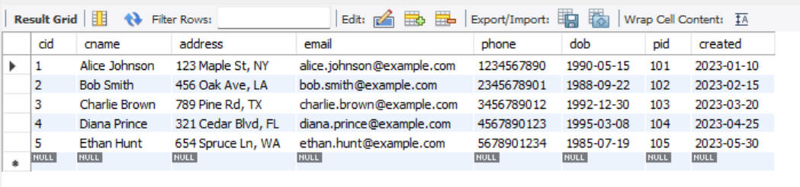
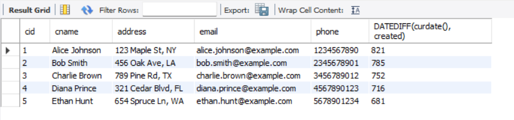
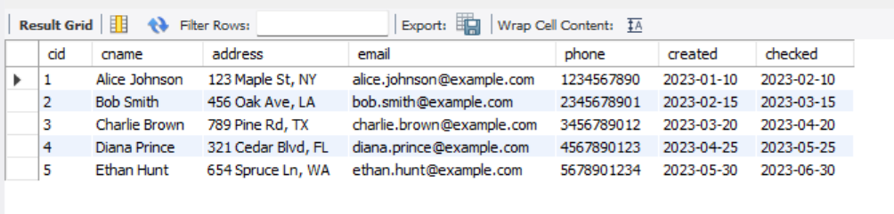
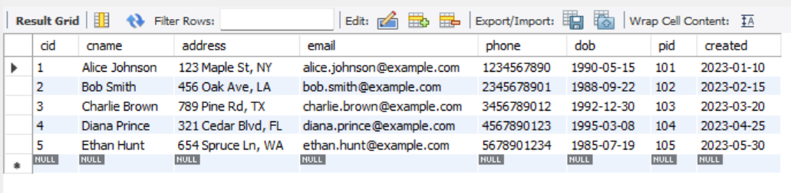
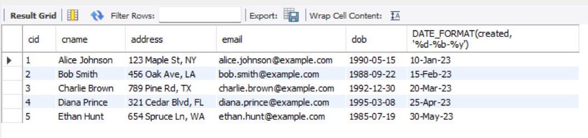

# Task - 6 Date and Time Functions

## Objective

- Manipulate and query data based on date and time values.

## Requirement

- Use built-in date functions (e.g., `DATEDIFF`, `DATEADD`, or your SQL dialect’s equivalent) to calculate intervals or adjust dates.
- Write a query to filter records based on date ranges (e.g., orders placed within the last 30 days).
- Format date outputs if necessary using functions like `CONVERT` or `TO_CHAR`.

## SQL used in task

```sh
SELECT * FROM Customers;
```



### DATEDIFF

```sh
SELECT cid, cname, address, email, phone, DATEDIFF(curdate(), created) from Customers;
```



### DATEADD

```sh
SELECT cid, cname, address, email, phone, created, DATE_ADD(created, INTERVAL 1 MONTH) as checked from Customers;
```



### FILTER

```sh
SELECT * from Customers WHERE created <= CURDATE() - INTERVAL 30 DAY;
```



### DATE_FORMAT

```sh
SELECT cid, cname, address, email, dob, DATE_FORMAT(created, '%d-%b-%y') FROM Customers;
```

