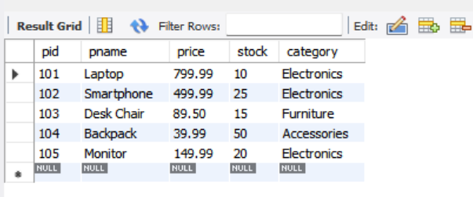
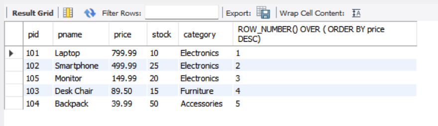
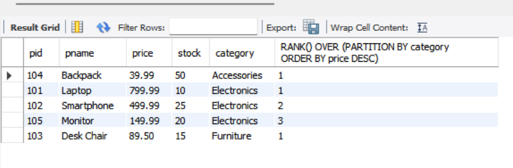
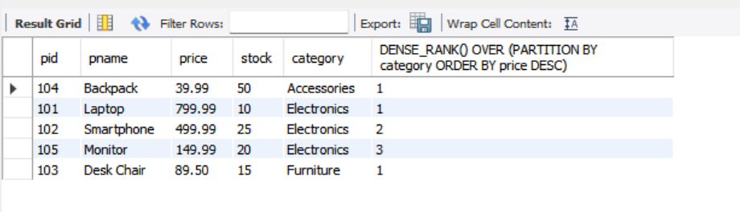
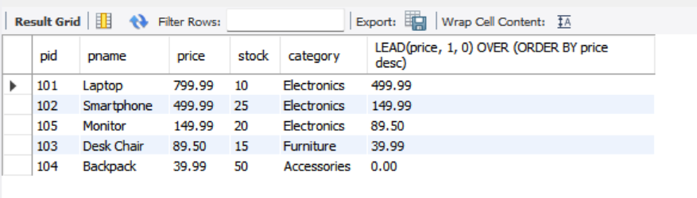
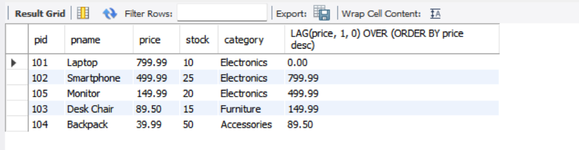

# Task - 7 Window Functions and Ranking

## Objective

- Leverage window functions to perform calculations across a set of rows.

## Requirement

- Write a query using window functions such as `ROW_NUMBER()`, `RANK()`, or `DENSE_RANK()` to assign ranks (e.g., rank employees by salary within each department).
- Use `PARTITION BY` to define groups and `ORDER BY` to specify the ranking order.
- Experiment with other window functions like `LEAD()` or `LAG()` to access adjacent row values.

## SQL Queries used

```sh
SELECT * FROM Products;
```



### Window Functions - ROW_NUMBER

```sh
SELECT *, ROW_NUMBER() OVER (order BY price DESC) FROM Products;
```



### Window Functions - RANK

```sh
SELECT *, RANK() OVER (PARTITION BY category ORDER BY pname DESC) FROM Products;
```



### Window Functions - DENSE_RANK

```sh
SELECT *, DENSE_RANK() OVER (PARTITION BY category ORDER BY price DESC) FROM Products;
```



### Window Functions - LEAD

```sh
SELECT *, LEAD(price, 1, 0) OVER (ORDER BY price desc) from Products;
```



### Window Functions - LAG

```sh
SELECT *, LAG(price, 1, 0) OVER (ORDER BY price desc) from Products;
```

