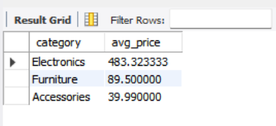
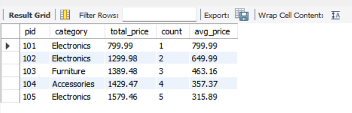

# Task - 8 Common Table Expressions (CTEs) and Recursive Queries

## Objective

- Simplify complex queries and process hierarchical data using CTEs.

## Requirement

- Write a non-recursive CTE to structure a multi-step query for readability (e.g., breaking down a complex aggregation).
- Create a recursive CTE to display hierarchical data (e.g., an organizational chart or a category tree).
- Ensure proper termination of the recursive CTE to avoid infinite loops.

## SQL Queries used 

### CTE

```sh
with prod_val as (
	select category, AVG(price) as avg_price from Products group by category
)
select * from prod_val;
```



### Recursive CTE

```sh
WITH RECURSIVE price_cte AS (
    SELECT 
        pid,
        category,
        price AS total_price,
        1 AS count,
        price AS avg_price
    FROM Products
    WHERE pid = 101

    UNION ALL

    SELECT 
        p.pid,
        p.category,
        pc.total_price + p.price,
        pc.count + 1,
        (pc.total_price + p.price) / (pc.count + 1)
    FROM Products p
    JOIN price_cte pc ON p.pid = pc.pid + 1
)

SELECT * FROM price_cte;
```

