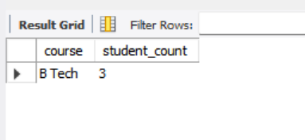
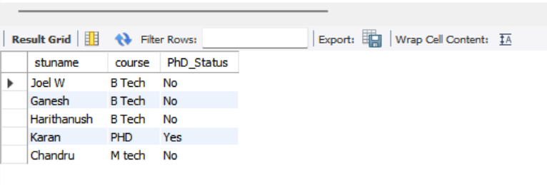

# Task - 9 Stored Procedures and User-Defined Functions

## Objective

- Encapsulate business logic using stored procedures and functions.

## Requirement

- Create a stored procedure that accepts parameters (e.g., a date range) and returns a result set (such as total sales within that range).
- Write a scalar or table-valued user-defined function that performs a calculation (e.g., calculates a discount or bonus based on input parameters).
- Test the procedure and function by calling them and verifying their outputs.

## SQL Queries used

```sql
DELIMITER $$

CREATE PROCEDURE GetStudentCountByDeptAddress(
    IN deptName VARCHAR(50),
    IN city VARCHAR(50)
)
BEGIN
    SELECT course, COUNT(*) AS student_count
    FROM students
    WHERE dept = deptName AND address = city
    GROUP BY course;
END $$

DELIMITER ;

CALL GetStudentCountByDeptAddress('CSBS', 'Trichy');
```




```sql
DELIMITER $$

CREATE FUNCTION IsPhD(phdFlag INT)
RETURNS VARCHAR(5)
DETERMINISTIC
BEGIN
    RETURN IF(phdFlag = 1, 'Yes', 'No');
END $$

DELIMITER ;

SELECT stuname, course, IsPhD(phd) AS PhD_Status FROM students;
```

